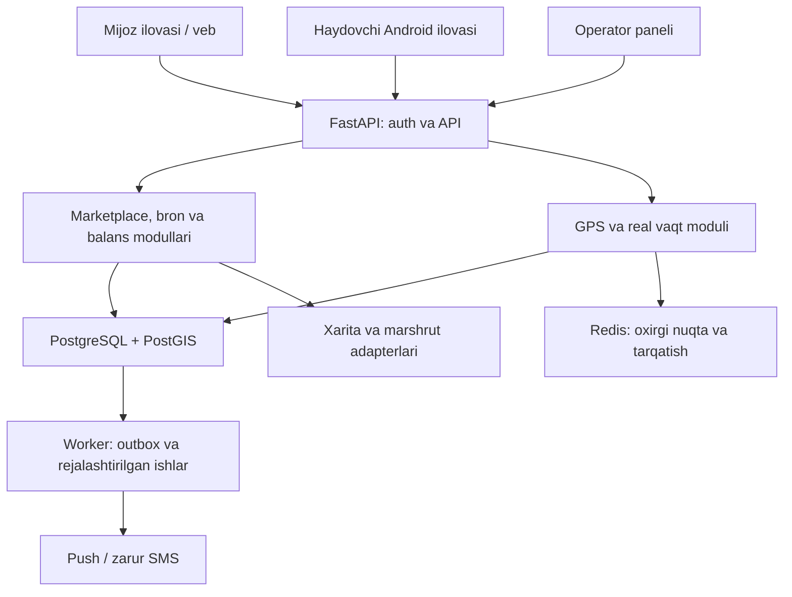
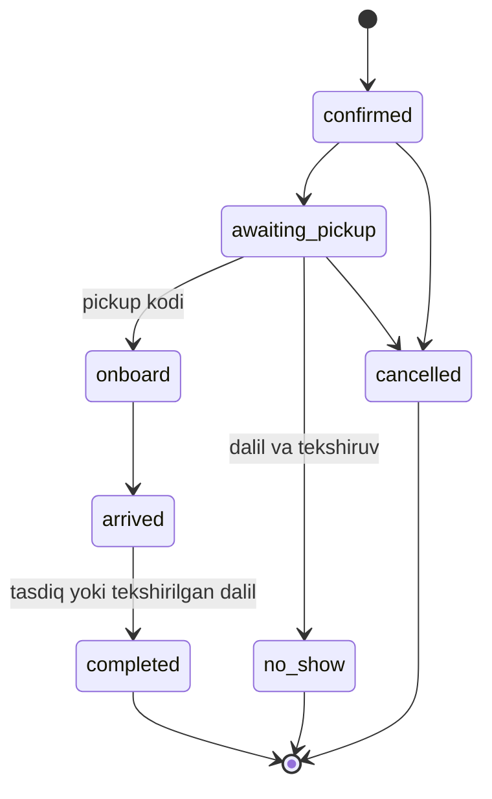

# ELCHI — 2-bosqich va production arxitekturasi

**Versiya:** 1.0 • **Sana:** 12.09.2026 • **Til:** o‘zbek, lotin yozuvi  
**Maqsad:** mavjud pochta MVPsini yo‘lovchi + pochta marketplace’iga bosqichma-bosqich kengaytirish va dasturlash agentlariga bajariladigan texnik topshiriq berish.

**Asos:** foydalanuvchining joriy talablari va taqdim etgan `PROJECT_OVERVIEW.md` fayli. Haqiqiy repository, server va ma’lumotlar bazasi taqdim etilmagan; quyidagi mavjudlik haqidagi xulosalar shu tavsifga asoslangan. Bu hujjat — amalga oshirish spetsifikatsiyasi; funksiyalar allaqachon yozilgan yoki production sinovidan o‘tgan degani emas. Narxlar va tashqi xizmatlar 12.09.2026 kuni ochiq rasmiy sahifalar orqali tekshirildi. Pilot limitlari, vaznlar va maqsadli ko‘rsatkichlar Elchi uchun taklif etilgan boshlang‘ich sozlamalardir.

## 1. Asosiy arxitektura qarori

Elchi’ning yadrosi **yo‘nalish va vaqtga bog‘langan ikki tomonlama marketplace** bo‘ladi. Mijoz ham, haydovchi ham e’lon beradi; ikkinchi tomon taklif yoki qarshi taklif yuboradi; amaldagi taklif qabul qilinganda majburiyatli bron yaratiladi. Bitta avtomobil safari bir nechta bronni olib yuradi.

Uch tushuncha alohida saqlanadi:

| Tushuncha | Mazmuni | Misol |
|---|---|---|
| `listing` — e’lon | Hali kelishilmagan talab yoki bo‘sh o‘rin/yuk imkoniyati | “Ertaga 13:00, Toshkent → Qarshi, 2 kishi, har biri 200 000 so‘m” |
| `booking` — bron | Ikki tomon qabul qilgan aniq segment, miqdor, vaqt, narx va shartlar | Ikki kishiga jami 400 000 so‘mlik kelishuv |
| `trip` — safar | Haydovchi va avtomobilning amaldagi marshruti | Bir safarda uchta yo‘lovchi broni va bitta pochta broni |

**Texnik tanlov:** mavjud FastAPI tizimi ichida chegaralari aniq modullar; PostgreSQL + PostGIS; Redis; alohida worker jarayoni; mavjud Expo/React klientlar; Docker Compose + Caddy. Bitta kod bazasidan API va worker ishlaydi. Pilotda Kubernetes, Kafka va ko‘p mustaqil mikroservis talab qilinmaydi. Ajratish zarur bo‘lsa, keyinchalik GPS qabul qilish va xabarnomalar birinchi nomzod bo‘ladi.



PostgreSQL bron, pul, status va bildirishnoma topshirig‘ining asosiy manbai. Redis o‘chishi hech bir bron yoki moliyaviy yozuvni yo‘qotmasligi kerak.

## 2. Mavjud asos va yopilishi kerak bo‘lgan bo‘shliqlar

| Mavjud tavsifdagi holat | Yangi talab bilan bog‘liq bo‘shliq | Qaror |
|---|---|---|
| FastAPI, SQLAlchemy, Alembic, PostgreSQL | Geo va marketplace kengaytmasi kerak | Stack saqlanadi; PostGIS va yangi modullar qo‘shiladi |
| `orders` mijozga tegishli pochta buyurtmasi | Haydovchi e’loni, yo‘lovchi, ko‘p bronli safar yo‘q | `listings`, `trips`, `bookings` alohida |
| `bids` faqat haydovchidan buyurtmaga | Ikki tomonlama kelishuv va o‘zgarmas taklif versiyalari kerak | `proposals` + `proposal_versions` |
| Shahar va tumanlar aynan teng bo‘lishi talab qilinadi | Yo‘lning oraliq segmentlari topilmaydi | Marshrut geometriyasi + tartibli bekatlar + yo‘l vaqti |
| Matching `is_available=true` bilan cheklanadi | Ertangi e’lon uchun hozir oflayn haydovchi yo‘qoladi | Hozirgi mavjudlik va kelajak jadvali ajratiladi |
| Komissiya 15% sifatida hisoblanadi | Uni real undirish, balans va qaytarish yo‘q | Oldindan to‘ldiriladigan komissiya balansi va ledger |
| Google/Yandex geokodlash, xarita ekranlari bor | Xarita ko‘rsatish real GPS tracking degani emas | Telefon → server → vakolatli kuzatuvchi oqimi |
| Xabarnoma faqat `in_app` | Ilova yopiq bo‘lsa taklif ko‘rinmaydi | Push, durable outbox, takror yuborishni boshqarish |
| Bitta `users.role` | Bir shaxs haydovchi ham mijoz ham bo‘lishi mumkin | `user_roles`, server tekshiradigan capability; UI’da rejim almashtirish |
| Bitta buyurtmaga bitta mijoz bahosi | O‘zaro baholash va xizmatlar bo‘yicha reputatsiya kerak | Bron bo‘yicha ikki tomonlama baho |
| Nizo buyurtma statusini almashtiradi | Yetkazish jarayoni va nizo bir-biriga aralashadi | Nizo mustaqil hayot sikliga ega bo‘ladi |
| Admin istalgan statusga o‘tkaza oladi | Joy va pul qoidalarini buzish xavfi | Admin ham domen buyruqlari va invarianti orqali ishlaydi |
| Geo tekshiruv tuman markazidan 75 km | Bu ma’muriy chegara yoki haqiqiy yo‘lni isbotlamaydi | Tekshirilgan poligon, bekat va yo‘l masofasi |
| Moliyaviy ko‘rsatkichlar frontendda birlashtiriladi | Hisoblangan komissiya tushgan pul deb ko‘rinishi mumkin | Backend moliyaviy hisobotlari ledgerdan olinadi |

Mavjud OTP, haydovchi hujjatlari, audit, refresh-token rotatsiyasi, nizolar, tarif va test infratuzilmasi qayta ishlatiladi. Kutubxona versiyalarining real mosligi lockfile va build orqali A0 agentida tekshiriladi.

## 3. inDrive’dan olinadigan tamoyillar va Elchi uchun to‘ldirishlar

inDrive ochiq sahifalarida foydalanuvchi narx taklif qilishi, haydovchini reyting, sharh va avtomobilga qarab tanlashi ko‘rsatilgan. Uning ichki backend topologiyasi, aniq reyting algoritmi yoki ledger sxemasi ochiq manbadan aniqlanmadi. Ushbu hujjatdagi texnik arxitektura Elchi uchun loyihalangan. [inDrive City to city](https://intercity.indrive.com/en)

| Olinadigan tamoyil | Shu modelda hisobga olinadigan ehtimoliy muammo | Elchi yechimi |
|---|---|---|
| Ikki tomon kelishadigan narx | Uzoq savdolashish, eskirgan taklif | Cheklangan tahrir, muddati bor versiyali taklif, jami narx |
| Haydovchini tanlash erkinligi | Faqat eng arzon variant ustunlashishi | Yo‘nalish va vaqt mosligi, ishonchlilik, narx, tajriba |
| Reyting va avtomobil ma’lumoti | 1 ta baholi 5.0 profil 200 ta baholi 4.8 dan ustun chiqishi | Baholar sonini hisobga oladigan tuzatish |
| Mos yo‘nalishlar lentasi | Talab kam joyda bo‘sh lenta | Yo‘l bo‘yicha mos segmentlar, saqlangan qidiruv, operator yordami |
| Safarni ulashish, yordamga murojaat | Havola orqali ortiqcha shaxsiy ma’lumot tarqalishi | Bronga bog‘langan, muddati cheklangan kuzatuv ruxsati |
| Naqd to‘lov | Platforma komissiyasi undirilmay qolishi | Haydovchi oldindan to‘ldiradigan balans, bron paytida hold |

Bu muammolar inDrive’da tasdiqlangan texnik nuqsonlar ro‘yxati emas; Elchi’da oldindan yopiladigan mahsulot va muhandislik xavflaridir. inDrive’ning ochiq xavfsizlik yo‘riqnomasida safarni ulashish va favqulodda yordam funksiyalari ham tasvirlangan. [inDrive xavfsizlik yo‘riqnomasi](https://blog.indrive.com/en-in/article/how-to-be-a-5-star-passenger-tips-for-a-safer-smoother-ride-hailing-experience)

## 4. Mahsulot chegarasi va ustuvorlik

| Daraja | Tarkib |
|---|---|
| **P0 — pullik yo‘lovchi pilotidan oldin** | Yo‘lovchi/pochta e’lonlari; ikkala tomon taklif berishi; jadval; segment sig‘imi; bron va bekor qilish; komissiya balansi; asosiy GPS; push; telefon/transport tekshiruvi; yordam; admin; tiklanadigan backup |
| **P1 — pilot davomida** | Qarshi taklif UX’i, kelishuv chati, saqlangan qidiruv, Telegram’ga ulashish, tushuntiriladigan tavsiyalar, bagaj aniqligi, o‘zaro baholash, yo‘ldagi olib ketish uchun eslatmalar |
| **P2 — pilot mezonlari bajarilgach** | Karta to‘lovi va qaytarish; to‘liq avtomobil bron qilish; yangi yo‘nalishlar; chuqur tahlil; firibgarlik signallari; ko‘proq avtomatlashtirish |
| **Hozircha chegaralangan** | Bir bronni bir nechta mashinaga bo‘lib yuborish, yo‘l o‘rtasida avtomatik transport almashtirish, avtomatik taksi parkiga pul tarqatish, murakkab dinamik tarif, ML reyting modeli |

P0’da kam funksiyali, ammo to‘liq yakunlanadigan yo‘lovchi oqimi chiqariladi. P1 ro‘yxatidagi har bir qulaylik texnik skeleti P0 kontraktlarida ko‘zda tutiladi; ayrim ekranlar keyin yoqilishi mumkin.

## 5. E’lonlar va ikki tomonlama narx kelishuvi

### 5.1 To‘rtta e’lon turi

| `kind` | `service_type` | Muallif | Miqdor va narx |
|---|---|---|---|
| `request` | `passenger` | Mijoz | Yo‘lovchilar soni; bir kishiga yoki jami narx |
| `request` | `parcel` | Mijoz | Bitta jo‘natma tavsifi; yetkazishning jami narxi |
| `trip_offer` | `passenger` | Tasdiqlangan haydovchi | Safardagi mavjud o‘rinlar; bir kishiga boshlang‘ich taklif |
| `trip_offer` | `parcel` | Tasdiqlangan haydovchi | Qabul qilinadigan yuk cheklovlari; narx bazisi |

Bitta safar uchun yo‘lovchi va pochta bo‘yicha ikkita e’lon bo‘lishi mumkin, lekin ikkalasi **bitta `trip_id`** va bitta jismoniy sig‘imdan foydalanadi. Avtomobilni ikki marta band qilishga yo‘l qo‘yilmaydi.

### 5.2 Majburiy maydonlar

Umumiy: boshlang‘ich/tugash hududi va xavfsiz uchrashuv nuqtasi, koordinatalar, sana, `departure_window_start/end`, vaqt zonasi, `price_basis`, summa, valyuta, xizmat turi, izoh, amal qilish muddati, xizmat hududi konfiguratsiyasi.

Yo‘lovchi: `seat_count`, kattalar/bolalar soni, bolalar o‘rindig‘i zarurati, bagaj miqdori, maxsus yordam talabi, ixtiyoriy qulayliklar. Bagajni yo‘lovchi o‘rindig‘iga yashirin hisoblash mumkin emas. Yolg‘iz voyaga yetmaganlar pilotga kiritilmaydi; bu Elchi pilot siyosati sifatida ko‘rsatiladi.

Pochta: turi, og‘irligi, o‘lchamlari, qadoq rasmi, mo‘rtligi, e’lon qilingan qiymati, jo‘natuvchi/oluvchi aloqasi, kim to‘lashi, olib ketish/topshirish oralig‘i. Pilot limiti va taqiqlangan jo‘natmalar ro‘yxati admin sozlamasida beriladi. E’lon qilingan qiymat sug‘urta kafolati sifatida ko‘rsatilmaydi.

Haydovchi: `vehicle_id`, safar va marshrut versiyasi, jami yo‘lovchi sig‘imi, mavjud bagaj/yuk sig‘imi, ruxsat etilgan bekatlar, chetlanish va kutish limiti. “4 ta bo‘sh joy” avtomobilning haydovchidan tashqari haqiqiy o‘rinlariga mos bo‘lishi shart.

Narx birligi majburiy: **“2 × 200 000 = jami 400 000 so‘m”**. Pochta uchun **“yetkazish narxi 70 000 so‘m”**. Tovar qiymati va yetkazish haqi boshqa maydonlarda saqlanadi. Pilotda naqd pul faqat tashish xizmatiga tegishli; tovar savdosi pulini undirish (`COD`) alohida keyingi mahsulotdir.

### 5.3 Kelishuv protokoli

1. Muallif e’lonni chiqaradi. Haydovchi javob berayotganda mavjud safarni tanlaydi yoki shu talab uchun e’lon qilinmagan safar yaratadi.
2. Qarshi tomon segment, miqdor, uchrashuv joyi, vaqt va narxdan iborat taklif beradi.
3. Har bir tuzatish yangi o‘zgarmas `proposal_version` yaratadi. Avvalgi versiya `superseded`; eski summani qabul qilish mumkin emas.
4. Taklifni faqat **amaldagi versiyani yubormagan qarshi tomon** qabul qiladi. O‘z taklifini o‘zi qabul qilish va o‘z e’loniga javob berish taqiqlanadi.
5. Qabul qilish PostgreSQL tranzaksiyasida taklif versiyasi, jadval, o‘rin, yuk va balansni qayta tekshiradi. Muvaffaqiyatli bo‘lsa bron va komissiya hold’i yaratiladi.
6. Mijoz talabi bitta bron bilan yopiladi. Ikki kishilik talab pilotda to‘liq bitta haydovchiga biriktiriladi. Haydovchi e’loni esa keyingi segmentlarda sig‘im qolgan bo‘lsa ochiq qolishi mumkin.
7. Qabul qilingan segment, narx yoki vaqtni o‘zgartirish alohida amendment va ikkala tomon roziligini talab qiladi. Tahrir bronni yashirin o‘zgartirmaydi.

Boshlang‘ich limit: har bir tomon bir muzokarada narxni 3 marta tuzatishi mumkin; bu hozirgi cheklov bilan uyg‘unlashtiriladi. Jo‘nashga 2 soatdan ko‘p vaqt bo‘lsa taklif TTL’i ko‘pi bilan 2 soat; yaqin jo‘nashlarda 10 daqiqa; hech qachon bron qabul qilish chegarasidan keyin emas. Muddati tugagan taklif yangilangan tekshiruvdan keyin qayta beriladi. Bu limitlar pilot ma’lumotlari bo‘yicha o‘zgartiriladi.

Oddiy taklif yuborish o‘rinni yoki balansni band qilmaydi. **Band qilish qabul qilingan bron paytida atomar bajariladi.** Shuning uchun “taklif berdim” ekrani “joyingiz bron qilindi” demaydi. Kelajak karta to‘lovi uchun vaqtinchalik seat-hold alohida kengaytma bo‘ladi.

### 5.4 Tahrir va takror e’lon

Taklif kelgan e’londa yo‘nalish, vaqt, miqdor yoki narx bazisi o‘zgarsa, uning versiyasi oshadi va mos bo‘lmagan takliflar yaroqsiz bo‘ladi. Bronli safar marshrutini haydovchi bir tomonlama o‘zgartira olmaydi. Bekor qilish sababi va kim boshlagani saqlanadi. E’lon muddati avtomatik tugaydi; vaqt o‘tgan post yangidek ko‘rinmaydi.

Bir shaxsning o‘sha sana, yo‘nalish va xizmatga juda o‘xshash postlari uchun dublikat tekshiruvi va foydalanuvchiga mavjud postni ochish taklifi beriladi. Yangi e’lon uchun miqdoriy rate-limit ishlaydi. To‘liq qayta-qayta nashr qilish bilan reytingni ko‘tarish mumkin emas.

## 6. Yo‘nalish va oraliq tumanlar bo‘yicha matching

### 6.1 Asosiy qoida

**E’lonning ma’muriy manzili va avtomobilning yuradigan yo‘li bir xil tushuncha emas.** Toshkent → Qarshi marshruti haydovchi tasdiqlagan real yo‘l geometriyasiga ega bo‘ladi. Chiroqchi shu marshrutdagi mos bekat yoki ruxsat etilgan chetlanish doirasida bo‘lsa, tegishli talabga tavsiya chiqadi. Barcha Toshkent → Qarshi yo‘llari albatta Chiroqchidan o‘tadi deb qabul qilinmaydi.

Mijozning **olib ketish va tushirish nuqtalarining ikkalasi** ham tekshiriladi. Faqat “shu tuman yo‘lda ekan” deb shu tuman foydalanuvchilarining barchasiga push berilmaydi. Foydalanuvchi saqlagan yo‘nalish, sana va xizmat turi mos bo‘lishi kerak.

### 6.2 Ma’lumot qatlami

- `regions`, `districts`, `settlements`: ma’muriy ierarxiya. Mavjud `cities.type=region` yozuvlari avtomatik haqiqiy shahar deb qabul qilinmaydi.
- `service_corridors`: marketing va operatsiya yoqadigan yo‘nalish koridori.
- `corridor_stops`: tekshirilgan bekat, koordinata, tuman, uchrashuv izohi va tartib.
- `route_versions`: haydovchi tasdiqlagan yo‘l geometriyasi, masofa, vaqt, provayder/manba versiyasi.
- `trip_stop_occurrences`: safardagi bekatning aniq uchrashi, tartibi va taxminiy vaqti. Takror o‘tiladigan joylar turli occurrence sifatida saqlanadi.
- `saved_searches`: foydalanuvchi yo‘nalishi, vaqt oynasi, xizmat, miqdor va bildirishnoma roziligi.

Pilot uchun 2–3 viloyat orasida **qo‘lda tekshirilgan bekatlar va asosiy yo‘llar katalogi** eng sodda nazorat qilinadigan boshlanishdir. Yo‘nalish bo‘ylab o‘tiladigan uchinchi viloyat avtomatik yangi bozor ochilganini anglatmaydi: yo‘lovchi olish/tushirish faqat faol bekatlar va xizmat segmentlarida yoqiladi.

### 6.3 Nomzod qidirish va aniq tekshiruv

1. Xizmat, faol koridor, e’lon muddati, yo‘nalish va vaqt bo‘yicha dastlabki filtr.
2. PostGIS GiST indeks yordamida pickup/dropoff nuqtalari marshrut yaqinidami, aniqlash. `ST_DWithin(...::geography, ...::geography, meters)` metrda ishlatiladi; `geometry(4326)` masofasini metr deb talqin qilish mumkin emas. [PostGIS ST_DWithin](https://postgis.net/docs/ST_DWithin.html)
3. Bekatlar ketma-ketligi bo‘yicha pickup dropoff’dan oldinmi, tekshirish. `ST_LineLocatePoint` oddiy chiziq bo‘yicha nomzod proyeksiyasini beradi, ammo halqa/takror yo‘llarda yakuniy haqiqat tartibli bekat/yo‘l segmentidir. [PostGIS ST_LineLocatePoint](https://postgis.net/docs/ST_LineLocatePoint.html)
4. Router orqali nuqtaga avtomobilda yetib borish, qo‘shimcha yo‘l va vaqtni tekshirish. Daryo, qarama-qarshi qatnov, yopiq burilish yoki tog‘ sabab chiziq yaqinligi yetarli bo‘lmasligi mumkin.
5. `pickup_eta_window`ni hisoblash: safar boshlanish vaqti + oldingi yo‘l bo‘laklari vaqti + kelishilgan bekatlar/kutishlar. Bu oraliq mijozning pickup oynasi bilan kesishishi kerak. Oraliq tumandagi mijoz uchun boshlang‘ich shahardan jo‘nash vaqti qo‘llanmaydi.
6. Har bir zarur segmentda o‘rin, bagaj va yuk resursi yetarliligini tekshirish; haydovchi roziligi va mavjud bronlarning vaqt shartlarini saqlash.
7. Qabul paytida barcha tekshiruvlarni yangi ma’lumot bilan qaytarish.

OSRM Route API yo‘l, vaqt va alternativ marshrut hisoblashga mos ochiq texnik asos beradi. Pilotda o‘z OSRM serverini boshqarish xarajati hosted routing bilan taqqoslanadi; ommaviy demo server production qaramligi qilib olinmaydi. [OSRM API](https://project-osrm.org/docs/v5.24.0/api/)

### 6.4 Tavsiya darajalari

| Daraja | Shart | Mijoz ko‘radigan izoh |
|---|---|---|
| `exact` | Tanlangan bekat/nuqtalar va vaqt bevosita mos | “Yo‘nalishingizga mos” |
| `on_route` | Oraliq segment, ruxsat etilgan bekatlar, ortga qaytishsiz | “Yo‘lingiz bo‘ylab” |
| `detour` | Haqiqiy yo‘l bo‘yicha chetlanish haydovchi limitida | “Kelishilgan nuqtadan olib ketadi; qo‘shimcha vaqt bor” |
| `alternative` | Qo‘shni bekat yoki boshqa vaqt, foydalanuvchi shartiga to‘liq mos emas | “Muqobil variant — boshqa bekat/vaqt” |

Boshlang‘ich keng qidiruv radiusi, masalan, 3 km; chetlanish limiti, masalan, qo‘shimcha jami 15 daqiqa va 5 km — **haydovchi tanlagan, operator sozlaydigan pilot qiymatlari**. Yakuniy moslik yo‘l bo‘yicha aniqlanadi. Mijozning bekatgacha bora olish masofasi alohida; haydovchiga ruxsat etilgan chetlanish mijozning yurish roziligini anglatmaydi.

Barcha qo‘shimcha pickup/dropoff’lar yig‘indisi marshrut chetlanish limitidan oshmasin. Har birini alohida “15 daqiqa” deb qabul qilib, safarni ikki soat cho‘zish mumkin emas. Yangi bron mavjud mijozlarning kelishilgan vaqt oynasini buzsa, avtomatik qabul qilinmaydi.

### 6.5 Yo‘nalish misollari

Quyidagilar haydovchi tasdiqlagan yo‘l Chiroqchidagi bekatni qamrab olgan **shartli** safar uchun:

| Mijoz qidiruvi | Toshkent → Qarshi safariga munosabat |
|---|---|
| Toshkent → Qarshi | To‘liq yo‘nalish mosligi |
| Toshkent → Chiroqchi | Mos oraliq segment; tushirish va narx alohida kelishiladi |
| Chiroqchi → Qarshi | Pickup vaqti Chiroqchiga kelish vaqtiga mos bo‘lsa chiqadi |
| Qarshi → Chiroqchi | Qarama-qarshi yo‘nalish, chiqmaydi |
| Chiroqchi → boshqa, marshrutdan tashqari joy | Shunchaki tuman mosligi sabab chiqmaydi |
| Chiroqchi markazi marshrutdan uzoqda | Faqat tasdiqlangan yo‘l bo‘yi bekati yoki kelishilgan chetlanish bilan |

Oraliq segmentning narxi avtomatik to‘liq marshrut narxi bo‘lmaydi. Haydovchi segment uchun narx beradi; tarixiy median mavjud bo‘lsa tavsiya qilinadi. Ma’lumot kamligida “taxminiy” belgisi bilan operator kiritgan tavsiya ishlaydi; masofaga mutanosib hisob yakuniy kelishuv o‘rnini bosmaydi.

### 6.6 Lenta va bildirishnoma

Bevosita mos e’lonlar va yo‘l bo‘yidagi variantlar avvaldan mavjud, foydalanuvchi bo‘sh ekran kutmaydi. Muqobil sana/bekatlar alohida rozilik bilan ochiladi. Filtrlar: xizmat, sana, vaqt oralig‘i, yo‘nalish, o‘rinlar, jami narx, qulayliklar. Default — tanlangan yo‘nalish; mamlakat bo‘ylab aralash lenta emas.

Hech kim topilmasa: “Hozir mos taklif yo‘q”; saqlangan qidiruv, keyingi sana va yaqin tasdiqlangan bekatlar, qo‘lda operator yordami. Soxta haydovchi, soxta reyting yoki mavjud bo‘lmagan taklif ko‘rsatilmaydi.

E’lon ko‘rish huquqi bilan push olish bir xil emas. Kelajak safarlari uchun oflayn foydalanuvchi lentadan chiqarilmaydi; push roziligi, jadval va faol qidiruv bo‘yicha yuboriladi. Dublikat yo‘nalishlar bitta bildirishnomaga birlashtiriladi. Bekor bo‘lgan yoki muddati tugagan e’lon push’i yuborilmaydi.

## 7. Segmentlar bo‘yicha o‘rin va yuk sig‘imi

Masalan, A → B → C → D safari, 4 ta yo‘lovchi o‘rni. A–C uchun 2 o‘rin, B–D uchun 1 o‘rin band:

| Segment | Band o‘rin | Bo‘sh o‘rin |
|---|---:|---:|
| A–B | 2 | 2 |
| B–C | 3 | 1 |
| C–D | 1 | 3 |

A–D uchun 2 kishi sig‘maydi; C–D uchun 3 kishi sig‘adi. Umumiy `available_seats=...` maydoni bu vazifani to‘g‘ri yechmaydi.

Har bir atomar yo‘l bo‘lagida `remaining = capacity − SUM(active allocations)`. Bron pickup occurrence’dan dropoff occurrence’gacha `[pickup, dropoff)` intervalni band qiladi. Tushgan yo‘lovchining o‘rni keyingi segmentda foydalaniladi.

Pilotdagi oddiy va ishonchli lock: qabul/bekor qilish/amendment vaqtida **trip satrini `FOR UPDATE`** bilan bloklash; shu tranzaksiyada segmentlar va balansni o‘zgartirish. Bir vaqtning o‘zida oxirgi o‘ringa ikki so‘rov kelsa, faqat sig‘adigan bron yaratiladi. Kelajak katta yuklamada segment lock’lariga o‘tish mumkin.

Pochta o‘rin sonidan alohida `cargo_weight_kg`, `cargo_volume_l` va o‘lcham chekloviga ega. Yo‘lovchi bagaji shu avtomobilning bagaj sig‘imini iste’mol qiladi. Hajm yig‘indisi mos tushishi jismoniy joylashishni to‘liq isbotlamaydi; katta/noto‘g‘ri shaklli yukni haydovchi aniq tasdiqlaydi.

Pilotda yangi bronlar safar jo‘nashidan oldin yopiladi; oldindan kelishilgan oraliq pickup’lar bajariladi. Yo‘lda yangi mijoz olish keyingi feature flag bo‘lib, haydovchi to‘xtaganida rozilik va yangi vaqt hisobini talab qiladi. Bu haydash paytida muzokara qilishni kamaytiradi.

Haydovchi va avtomobil uchun ustma-ust vaqtli ikkita faol safar taqiqlanadi. PostgreSQL exclusion constraint yoki ekvivalent tranzaksion tekshiruv planned interval + tayyorgarlik buffer bo‘yicha ishlaydi. `driver_routes` esa qiziqish/preferensiya bo‘lib qoladi; u avtomobil bandligini ifodalamaydi.

## 8. Takliflarni saralash: aniq, tushuntiriladigan va adolatli

### 8.1 Avval ruxsat va moslik

Saralashdan oldin: haydovchi tasdiqlangan, akkaunt faol, xizmat hududi ochiq, taklif yangi, yo‘nalish/vaqt/sig‘im mos, taraflar bir-birini bloklamagan, transport talabi bajarilgan. Balans yetishmasligi kabi qabulni bloklaydigan holat bo‘lsa taklif “qabul qilishga tayyor” sifatida yuqorida ko‘rsatilmaydi; haydovchiga to‘ldirish zarurligi aytiladi.

Reyting vaznlari jiddiy xavfsizlik blokini yumshatmaydi. Himoyalangan demografik belgilar reytingga kiritilmaydi.

### 8.2 Mijoz uchun boshlang‘ich ball

`score_client = 100 × (0.30M + 0.20T + 0.20R + 0.20P + 0.10E)`

| Belgi | 0–1 ga normalizatsiya | Vazn |
|---|---|---:|
| M | `exact=1.00`, `on_route=0.90`, ruxsat etilgan `detour=0.65`; alternativlar alohida guruh | 30% |
| T | `max(0, 1 − abs(pickup_eta − desired_time) / tolerated_minutes)`; tolerantlik 0 bo‘lsa faqat aniq mos vaqt 1 | 20% |
| R | 0.60 × tuzatilgan baho + 0.25 × ishonchli bajarish + 0.15 × o‘z vaqtida kelish | 20% |
| P | Bir xil segment va xizmatdagi **jami narx** uchun `clip((U − price)/(U − L), 0, 1)` | 20% |
| E | `min(1, ln(1 + completed_trips)/ln(101))` | 10% |

`L/U` — mos xizmat, segment va vaqt bo‘yicha ishonchli narx diapazoni. Pilotda yetarli kuzatuv bo‘lmasa admin tasdiqlagan diapazon; u ham bo‘lmasa barcha takliflarga `P=0.5`. `U=L` bo‘lsa ham `P=0.5`. Diapazonni joriy e’lon ichidagi tasodifiy eng past/yuqori narx bilan qayta belgilash mumkin emas.

Reyting tuzatishi: `adjusted_rating = (n × average_rating + m × prior_rating) / (n + m)`. Boshlang‘ich `m=10`; masalan `prior_rating=4.5`. Prior Elchi ko‘rsatkichlari yetilgach yangilanadi. UI’da yangi haydovchiga sun’iy “4.5” yozilmaydi: “Yangi, hujjatlari tekshirilgan” ko‘rsatiladi. Tuzatish ichki tartiblash uchun.

Bajarish ulushi uchun `C=(completed + 10×prior_completion)/(eligible_resolved + 10)`. Mijoz aybi, yo‘l yopilishi yoki operator tasdiqlagan asosli bekor qilish haydovchining aybli bekor qilishi sifatida hisoblanmaydi. O‘z vaqtida kelish ham baholashga yaroqli safarlar va prior bilan hisoblanadi. Boshlang‘ich prior_completion/on_time=0.90 — taxmin; statistik fakt emas. `R=0.60×(adjusted_rating/5)+0.25C+0.15O`.

Tajriba uchun bitta trip’dagi 8 ta bron “8 ta safar” deb sanalmaydi. Xizmat bo‘yicha bajarilgan bronlar va yakunlangan avtomobil safarlari alohida metrikalar.

### 8.3 Hisob misoli

Bir xil segment, 2 kishi, `L=300 000`, `U=450 000`; barcha vaqtlar mos:

| Taklif | Jami narx | M | T | R | E | P | Yakuniy ball |
|---|---:|---:|---:|---:|---:|---:|---:|
| A | 400 000 | 1.00 | 0.95 | 0.90 | 0.80 | 0.3333 | 81.67 |
| B | 360 000 | 1.00 | 0.85 | 0.95 | 1.00 | 0.60 | 88.00 |
| C | 300 000 | 0.65 | 0.70 | 0.75 | 0.20 | 1.00 | 70.50 |

Bu namunaviy ballar; haqiqiy Elchi statistikasi emas. Eng arzon taklif doim birinchi bo‘lishi shart emas. UI’da “Tavsiya”, “Eng arzon”, “Vaqti mos”, “Yuqori baholangan” saralashlari bo‘ladi. Yakuniy tanlov insonda.

### 8.4 Haydovchi uchun boshqa narx mezoni

Haydovchiga mijoz takliflarini ko‘rsatishda arzonlikni mukofotlash xato. `score_driver = 100 × (0.35M + 0.20T + 0.20Y + 0.15C + 0.10F)`:

- `Y`: shu segment, miqdor va xizmat uchun komissiyadan keyingi tushumning mos bazaviy taklifga nisbati. `Y=clip((net_total/reference_net_total − 0.5), 0, 1)`. Reference yetarli tarix yoki operator konfiguratsiyasidan; ishonchli reference bo‘lmasa `Y=0.5`. Chetlanish xarajati M/T orqali ham aks etadi; UI uni alohida ko‘rsatadi.
- `C`: mijozning tasdiqlangan kelishuvlarga rioya qilishi; yangi mijoz uchun neytral prior.
- `F`: yo‘lovchida `requested_seats / min_remaining_seats_on_segment`; pochtada ma’lum vazn/hajm resurslarining ishlatiladigan ulushlari maksimumi; natija 0–1. Ma’lumot noma’lum bo‘lsa 0.5 va qo‘lda sig‘im tasdig‘i. Sig‘im yetishmasligi ball emas, qat’iy rad.

Sof tushum hisobida `agreed_total − commission` ishlatiladi; “sof foyda” deyilmaydi, chunki yoqilg‘i va avtomobil xarajati to‘liq noma’lum. Y/F reference va vaznlari koridor konfiguratsiyasida versiyalanadi, natija bilan `ranking_version` qaytadi. ML’ga o‘tishdan oldin oddiy qoidalar va haqiqiy konversiya o‘lchanadi.

Yangi tasdiqlangan haydovchilarga xavfsizlik va yo‘nalish shartlarini buzmagan holda oz miqdorda navbatli ko‘rinish beriladi. Bu siyosat izohlanadi; pullik joylashtirish bo‘lsa alohida belgilanishi kerak. Pilotda yashirin pullik reyting bo‘lmaydi.

## 9. Naqd to‘lov va haydovchi balansi

### 9.1 Pulning ma’nosi

Mijoz tashish haqini haydovchiga naqd beradi. **Haydovchi balansi — Elchi komissiyasini to‘lash uchun oldindan kiritilgan mablag‘.** U haydovchining barcha naqd tushumi yoki yechib olinadigan daromad hamyoni emas.

UI alohida ko‘rsatadi: komissiya balansi, band qilingan komissiya, yangi bron uchun mavjud summa, naqd olingani tasdiqlangan xizmat haqi, hisoblangan komissiya. Pochta qabul qiluvchi to‘lasa bu kelishuvda oldindan belgilanadi.

### 9.2 Pilot modeli

Default: oldindan to‘ldirish, manfiy balans va avtomatik kredit yo‘q. Haydovchi balans yetmasa e’lon ko‘rishi mumkin, lekin to‘lovli yangi bronni tasdiqlay olmaydi. Avvaldan tasdiqlangan yoki boshlangan safar, GPS va yordam balansi sabab bloklanmaydi.

To‘ldirish: bank ko‘chirmasi bilan tasdiqlangan kirim yoki vakolatli kassir qabul qilgan naqd pul. Haydovchi skrinshot yuklagani pul tushganini isbotlamaydi. Operator so‘rov tayyorlashi mumkin; moliyaviy huquqli xodim manba dalili va yagona reference bilan tasdiqlaydi. Bir xil reference ikkinchi marta kredit bermaydi. Katta tuzatishlar uchun ikki xodim tekshiruvi belgilanadi.

Pilot imtiyozi kerak bo‘lsa aniq muddatli **0% yoki kamaytirilgan komissiya kampaniyasi** ishlatiladi; pul kelmagan holda “naqd balans to‘ldirildi” yozilmaydi. Stavka va kampaniya har bir bronda snapshot bo‘ladi. Mavjud 15% default yangi biznes siyosati o‘rniga avtomatik optimal stavka deb olinmaydi.

### 9.3 Misol

Mavjud default stavka 15% bo‘lgan hisob misoli: 2 × 200 000 = **400 000 so‘m** tashish haqi; komissiya **60 000 so‘m**. Haydovchi balansida 100 000 so‘m bor.

| Hodisa | Ledger bo‘yicha balans | Hold | Mavjud summa |
|---|---:|---:|---:|
| Bron oldidan | 100 000 | 0 | 100 000 |
| Bron qabul qilindi | 100 000 | 60 000 | 40 000 |
| Xizmat yakunlandi, komissiya yechildi | 40 000 | 0 | 40 000 |

Mijoz haydovchiga 400 000 so‘m naqd beradi. Komissiyadan keyingi tashish tushumi 340 000 so‘m; naqd pulning o‘zi Elchi balansiga qayta kredit qilinmaydi. Agar xizmat boshlanishidan oldin jarimasiz bekor qilinsa, 60 000 so‘mlik hold bo‘shaydi va mavjud summa 100 000 so‘mga qaytadi.

### 9.4 Moliyaviy texnik qoidalar

- Pul: `BIGINT` minimal birlikda, UZS uchun 1 so‘m = 100 tiyin; API’da birlik aniq. Float ishlatilmaydi. Eski Numeric qiymatlar Decimal orqali aniq ko‘chiriladi. Stavka integer basis point: 15% = 1500 bps.
- `commission_minor = round_half_up(total_minor × fee_bps / 10000)`. Bitta server funksiyasi va versiyalangan policy.
- `available = posted_prepaid_balance − active_holds`. Hold buxgalteriya o‘tkazmasi emas, sarflanadigan limit rezervidir.
- Haqiqiy to‘ldirish: Dr bank/kassa aktiv hisobi, Cr haydovchi oldindan to‘lov majburiyati. Komissiya capture: Dr shu majburiyat, Cr komissiya daromadi. Soliq va fiskal bo‘linmalar production hisob siyosati bo‘yicha alohida aniqlashtiriladi.
- Capture va hold release bitta tranzaksiyada. `booking_id + charge_kind` uchun yagona komissiya yozuvi. Retry yoki ikki marta tugatish ikki marta pul yechmaydi.
- `ledger_transactions` + `ledger_entries` o‘zgarmas. Har valyutada debit va credit yig‘indisi teng; yangi yozuv balance cache’ni atomar yangilaydi. Kechasi qayta solishtirish ledger bilan farqni aniqlaydi.
- Xato yozuv o‘chirilmaydi, unga havolali teskari o‘tkazma qilinadi. Auditda actor, sabab va dalil bo‘ladi.
- Komissiya daromadi, hisoblangan komissiya, real pul kirimi va qaytarilgan summa alohida hisobotlar.

### 9.5 Qachon yechiladi va nizo bo‘lsa nima bo‘ladi?

Hold bron tasdiqlanganda yaratiladi. Yo‘lovchi safarining bajarilishi yoki pochta topshirilishi isbotlanganda xizmat yakunlanadi; jiddiy ochiq nizo bo‘lmasa komissiya capture qilinadi. Pochta uchun qabul qilish kodi yoki tekshirilgan operator dalili; yo‘lovchi uchun boshlash kodi va yakunlash tasdig‘i qo‘llanadi. GPSning o‘zi yuk topshirilganini isbotlamaydi.

Mijoz javob bermasa: oddiy yashirin avtomatik debit emas, oldindan e’lon qilingan tasdiqlash oynasi va dalillar asosida finalizatsiya; pilot default — 24 soatda operator navbatiga chiqarish. Ochiq moliyaviy/yetkazish nizosi hold’ni tekshiruvgacha saqlaydi; 48 soatda eskalatsiya va mas’ul xodim. Hold muddatini shunchaki tugatib, komissiyani yo‘qotish yoki darhol undirish mumkin emas.

Naqd haq to‘lanmagani xizmat bajarilmaganiga teng emas. `service_status`, `cash_collection_status` va `fee_status` mustaqil. Haydovchi “pul olindi” deydi, mijoz rad etsa `payment_dispute` ochiladi. Platforma mijoz naqd to‘laganini texnik jihatdan mutlaq kafolatlay olmaydi.

Capture’dan keyin asosli nizo qanoatlantirilsa, ledger reversal yoki qisman adjustment qo‘llanadi. Pilot bekor qilish jarimasi default 0; pullik jarima keyin joriy etilsa, oldindan shartlarda aniq ko‘rinadi.

### 9.6 Keyingi karta bosqichi

Kelajak modelida `payment_intents`, `payment_attempts`, `provider_events`, `refunds`, `settlements` kiritiladi. Hosted checkout/tokenization, imzo tekshirilgan webhook va provider event unique kaliti kerak. Ilova qaytish URL’i to‘lov tasdig‘i bo‘lmaydi. PAN/CVV Elchi serverida saqlanmaydi.

Karta bilan olingan tashish puli uchun komissiya settlement ichida ushlansa, prepaid balansdan yana yechilmaydi: **bitta bron uchun bitta commission charge**, settlement strategiyasi bilan. Haydovchiga to‘lanadigan pul prepaid komissiya balansidan alohida hisobda. Provayder tanlovi merchant shartnomasi, qaytarish va hisob-kitob imkoniyatlari bilan keyingi bosqichda yakunlanadi.

## 10. Arzon GPS tracking: tanlov va ishlash tartibi

### 10.1 To‘rtta xizmatni ajratish

| Qatlam | Vazifasi | Elchi uchun tanlov |
|---|---|---|
| Telefon lokatsiyasi | Koordinata, aniqlik, vaqt, tezlik | Expo Location / Android location API |
| Tracking backend | Nuqtani qabul qilish, saqlash, vakolatli mijozga uzatish | Mavjud FastAPI + PostgreSQL + Redis |
| Xarita tasviri | Ko‘chalar, marker, marshrut | MapLibre + litsenziyasi mos tiles provayderi |
| Routing/geokodlash | Yo‘l, taxminiy vaqt, manzil qidirish | Adapter ortidagi hosted API; keyin o‘z routing serveri |

Telefon koordinatasini o‘z serveriga yuborish uchun har bir GPS nuqtaga Google Maps so‘rovi qilish talab etilmaydi. Internet, backend, xarita yuklanishi va operatsion xizmat xarajatlari mavjud. **Real tracking “butunlay bepul xarita servisi” bilan bir narsa emas.**

### 10.2 Variantlarni baholash

| Variant | Amaldagi imkoniyat | Elchi uchun baho |
|---|---|---|
| O‘z tracking endpoint’i + MapLibre + Geoapify | Geoapify Free: 3 000 kredit/kun; commercial foydalanishga attribution bilan ruxsat; Free SLA kafolati deb olinmaydi | Juda kichik pilot uchun birinchi sinov; kvota hisoblagich va keyingi tarif tayyor bo‘lsin |
| O‘z tracking endpoint’i + MapLibre + MapTiler Flex | Flex $30/oy bazaviy; ortiqcha trafik alohida; Free sahifada testing/personal/non-commercial uchun | Pullik kichik xarita varianti; geometriya/routing alohida baholanadi |
| Self-hosted Traccar | Ochiq kodli GPS platformasi, telefon tracking’i bor; server va integratsiya xarajati qoladi | Alohida qurilma va dispetcher kuzatuvi kerak bo‘lsa foydali; Elchi auth/bron ruxsatlariga adapter kerak |
| O‘z OSRM va tiles infratuzilmasi | Ko‘proq nazorat, resurs va xarita yangilashni boshqarish zarur | Faqat tashqi API xarajati operatsion xarajatdan oshganda |
| Ommaviy OSM tiles/Nominatim | Ochiq ma’lumotga xizmat qiladi, foydalanish cheklovlari bor | Production tracking/geokodlashning kafolatlangan bepul asosi sifatida olinmaydi |

Manbalar: [Geoapify tariflari](https://www.geoapify.com/pricing/), [MapTiler tariflari](https://www.maptiler.com/cloud/pricing/), [Traccar](https://www.traccar.org/). Narxlar USD, soliqlar va boshqa to‘lovlar alohida bo‘lishi mumkin; yuqoridagi boshlang‘ich taklif provayderlar hisobini ochish yoki xarid qilish degani emas.

OSM standart tiles xizmati SLA bermaydi; noto‘g‘ri foydalanish bloklanishi mumkin. Public Nominatim’da umumiy maksimal 1 so‘rov/soniya, autocomplete taqiqlangan, tracking/geokodlash mahsulotlariga oid qo‘shimcha cheklovlar bor. Uni Elchi’ga bepul universal geokoder sifatida o‘rnatish rejalashtirilmaydi. [OSM tiles siyosati](https://operations.osmfoundation.org/policies/tiles/), [Nominatim siyosati](https://operations.osmfoundation.org/policies/nominatim/)

MapLibre — xarita renderer’i; production tiles manbai alohida beriladi. Expo/native integratsiya development build’da tekshiriladi. Hozirgi Google/Yandex komponentlari `MapAdapter` orqali bosqichli almashtiriladi; bir provayderdan olingan ma’lumotni boshqa xaritada ishlatish yoki uzoq saqlashdan oldin uning foydalanish shartlari tekshiriladi. [MapLibre React Native](https://maplibre.org/maplibre-react-native/docs/setup/getting-started/)

### 10.3 Tavsiya etiladigan GPS oqimi

1. Tasdiqlangan haydovchi ilovasida faol safar uchun kuzatuv boshlanadi. Oldindan berilgan e’lon uchun ikki kun uzluksiz GPS ishlamaydi.
2. Telefon lokatsiya nuqtalarini lokal SQLite outbox’ga yozadi. Normal harakatda yuborish nishoni 10 soniya; kutishda 30–60 soniya; yaqinlashishda 5–10 soniya. Bu OS kafolati emas, ilova konfiguratsiyasi.
3. HTTPS orqali `POST /tracking/sessions/{id}/points:batch` yuboriladi. Har nuqta `session_id`, `seq`, `captured_at`, `lat`, `lng`, `accuracy_m`, ixtiyoriy speed/heading/battery’ga ega.
4. Server haydovchi, qurilma sessiyasi va safar ruxsatini tekshiradi. Qabul qilingan nuqtalarni PostgreSQL’ga yozib, transaction commit’dan keyin ACK qaytaradi. Redis’da oxirgi ishonchli nuqta yangilanadi.
5. Vakolatli foydalanuvchiga WebSocket orqali marker/holat yuboriladi. Ulanish uzilsa HTTP snapshot va 10–15 soniyali polling mavjud.
6. Safar/bron tugashi yoki ruxsat bekor qilinishi bilan kuzatuv huquqi yopiladi. Avtomobilning boshqa mijozlar bilan keyingi yurishi oldingi mijozga ko‘rinmaydi.

GPS **haydovchi telefonini** kuzatadi. Pochta yoki yo‘lovchida alohida tracker bo‘lmasa, “pochta qurilmasining koordinatasi” deb ko‘rsatilmaydi; “buyurtmangizni olib ketayotgan avtomobil” deyiladi. Telefon uzilsa jismoniy yuk joylashuvini aniq bilish kafolati yo‘q.

### 10.4 Eskirgan va noto‘g‘ri nuqtalar

Boshlang‘ich UI qoidasi: 0–30 soniya — yangi; 31–120 soniya — kechikkan; 120 soniyadan katta — “Aloqa uzilgan, oxirgi yangilanish …”. Aniqligi 100 metrdan yomon nuqta ishonchliligi past deb belgilanadi, zarur bo‘lsa radius ko‘rsatiladi. Bu chegaralar dala sinovida moslashtiriladi.

Har nuqtada `captured_at` va server `received_at` alohida. Retry dublikatlari `UNIQUE(session_id, seq)` orqali yo‘qotiladi. Kechikib yuborilgan eski nuqta tarixga tushishi mumkin, ammo live marker’ni orqaga surmaydi. Qayta boshlangan qurilma yangi sessiya oladi; ayni trip uchun bitta amaldagi yozuvchi sessiya bor.

Pilot batch limiti: 100 nuqta/so‘rov; lokal navbat 24 soat yoki 20 000 nuqtagacha. Server 24 soatdan eski paketlarni oddiy ingestion’dan rad etadi; maxsus dalil importi operator jarayonidir. Navbat limitidan oshsa eng eski nuqtalar tashlanadi va `tracking_gap` qayd etiladi; ilova yo‘qolgan tarixni mavjud deb ko‘rsatmaydi. ACK faqat DB commit’dan keyin; qabul qilingan/rejected seq’lar aniq qaytariladi.

Keskin sakrash, mumkin bo‘lmagan tezlik, kelajak timestamp, mock-location signali va past accuracy tekshiruvga olinadi. Birgina shubhali nuqta avtomatik aybdorlik yoki safarni bekor qilishga sabab bo‘lmaydi. Marker oxirgi ikki ishonchli nuqta orasida qisqa animatsiya qilinishi mumkin, aloqa yo‘q paytda taxminan yurayotgandek cheksiz animatsiya qilinmaydi.

### 10.5 Android cheklovlari

Tracking real Android qurilmasidagi release/development build’da sinovdan o‘tadi. Fon lokatsiyasi uchun foydalanuvchi ruxsati, mos foreground service va ko‘rinadigan notification sozlanadi. Expo Location hujjatida ilova foydalanuvchi tomonidan to‘liq yopilganda fon lokatsiyasi to‘xtashi ko‘rsatilgan. Web/PWA haydovchining uzluksiz fon tracking’i uchun asosiy klient bo‘lmaydi. [Expo Location](https://docs.expo.dev/versions/latest/sdk/location/), [Android background location](https://developer.android.com/develop/sensors-and-location/location/permissions/background)

Ekran o‘chishi, battery saver, internet uzilishi va app force-stop alohida ssenariy. Qayta ochilganda safar tiklanadi; eskirgan sessiya yangi sessiyani bosib ketmaydi. Telefon qayta yoqilganda yoki ruxsat olib tashlanganda ilova holatni tekshiradi va haydovchiga aniq ko‘rsatma beradi. Fon ruxsati yo‘q bo‘lsa “GPS faol” yozuvi chiqarilmaydi.

### 10.6 Kuzatish huquqi

- Mijoz faqat o‘z broni uchun ruxsat etilgan vaqt oynasida tracking ko‘radi. Yo‘lovchi uchun odatiy boshlanish — kelishilgan pickup’ga 30 daqiqa qolganda; pochta uchun yuk olinganidan topshirilguncha. Erta pickup kelishuvi bo‘lsa ruxsat voqeasi yangilanadi.
- Qabul qilishdan oldin uy manzili, telefon va aniq GPS ommaviy e’londa yo‘q. Tasdiqlangan uchrashuv bekati ochiq bo‘lishi mumkin.
- Boshqa bron egalari, oluvchilar manzili, pochta turi va to‘liq safar manifesti mijozga berilmaydi.
- Qabul qiluvchi ilovasiz kuzatishi uchun kamida 128 bit tasodifiy token; token bazada hash qilinadi, booking, scope va muddatga bog‘lanadi. Havola bekor qilinadi, tugagan brondan keyin yopiladi. Sahifada uchinchi tomon analytics yo‘q, `Referrer-Policy: no-referrer`.
- Operator faqat operatsion vazifasi doirasida ko‘radi; keng tarixiy kirish auditga yoziladi.

### 10.7 Saqlash va taxminiy yuklama

Pilot reja misoli: 50 haydovchi × 6 soat × 3600 / 10 soniya = **108 000 nuqta/kun**, faol paytda taxminan **5 nuqta/soniya**. Bitta nuqta payload’i 250 bayt deb faraz qilinsa 27 MB/kun faqat payload; HTTP/TLS, indeks, WAL, backup va kuzatuvchilarga uzatish bunga qo‘shiladi. Bu o‘lchangan production natijasi emas.

Nuqtalar sana bo‘yicha partition qilinadi. Taklif etilgan retention: raw GPS 7 kun, siyraklashtirilgan safar izi 30 kun; ochiq nizo uchun belgilangan dalil nusxasi alohida, kirishi cheklangan saqlash qoidasi bilan. Haqiqiy muddatlar mahsulot ehtiyoji va mahalliy talablar tekshirilgach tasdiqlanadi. Ledger va audit muddati GPSdan mustaqil.

Har nuqta uchun reverse-geocode va routing chaqirilmaydi. ETA qayta hisobi masalan 60–120 soniyada, yo‘ldan sezilarli chiqishda yoki bekat rejasi o‘zgarganda. Trafik ma’lumoti bo‘lmasa ETA “taxminiy” deyiladi.

### 10.8 Xarita kvotasini hisoblash

Geoapify’da map tile 0.25 kredit, oddiy geokodlash 1 kredit; routing’da waypoint va yo‘l uzunligiga qarab xarajat o‘zgaradi. [Geoapify kredit qoidalari](https://www.geoapify.com/pricing-details/)

**Faraziy** 150 xarita sessiyasi/kun × 50 tile = 7 500 tile = 1 875 kredit. Yana 300 geokodlash va 300 routing krediti bo‘lsa jami 2 475 kredit/kun. Bu 3 000 limit ichiga sig‘adi, lekin uzoq live-map sessiyasida pan/zoom va yangi hududlar tile sarfini ko‘paytiradi. 150 foydalanuvchi = 150 sessiya degani emas.

Kunlik iste’mol 70% ga yetganda operatorga signal; 85% da zarur bo‘lmagan autocomplete/statik preview cheklanadi va pullik plan/fallback tayyorlanadi. Xarita provayderi ishlamasa bron matni, aloqa, oxirgi manzil va vaqt saqlanadi. Tracking ma’lumotini qabul qilish xarita kvotasi sabab to‘xtamaydi. Attribution va ruxsat etilgan cache siyosati buzilmaydi.

## 11. Holatlar va dalillar

`listing`, `proposal`, `trip`, `booking`, `payment`, `commission` va `dispute` mustaqil holat mashinalari. Bitta `status`ga hamma holatni tiqish mumkin emas.

| Obyekt | Asosiy holatlar |
|---|---|
| Listing | `draft`, `published`, `paused`, `fulfilled`, `expired`, `cancelled` |
| Proposal | `active`, `superseded`, `accepted`, `rejected`, `withdrawn`, `expired` |
| Trip | `planned`, `boarding`, `in_progress`, `completed`, `cancelled`, `interrupted` |
| Passenger booking | `confirmed`, `awaiting_pickup`, `onboard`, `arrived`, `completed`, `cancelled`, `no_show` |
| Parcel booking | `confirmed`, `awaiting_pickup`, `picked_up`, `in_transit`, `delivered`, `completed`, `cancelled`, `return_required`, `returned`, `delivery_failed` |
| Cash collection | `unpaid`, `reported_paid`, `acknowledged`, `contested` |
| Commission | `exempt`, `held`, `captured`, `released`, `partially_reversed`, `reversed` |
| Dispute | `open`, `under_review`, `resolved`, `rejected` |



Bu diagramma yo‘lovchi broniga tegishli. Yo‘lovchi minishi uchun kod bitta bron va amalga bog‘langan, hash saqlanadi, urinish limiti bor. Pochta pickup va delivery kodlari alohida; pickup kodi bilan yetkazishni yakunlab bo‘lmaydi. Kodni haydovchi o‘ziga olib, o‘zi tasdiqlashi mumkin emas. Offline holatda lokal “kutilmoqda” amal saqlanadi; server tasdiqlamaguncha moliyaviy yakun bo‘lmaydi.

Mijoz yetib kelmasa: haydovchi tasdiqlangan bekatda “keldim”ni belgilaydi, kutish hisoblagichi boshlanadi, aloqa urinishlari saqlanadi. Masalan 10 daqiqalik pilot kutish qoidasi e’londa oldindan ko‘rinadi. O‘z vaqtida kelmagan haydovchi no-show’ni mijozga bir tomonlama yuklay olmaydi. Avtomatik pul jarimasi pilotda yo‘q.

Pochta olingandan keyin oddiy `cancelled` va hold release mumkin emas: qaytarish yoki yetkazish muvaffaqiyatsizligi jarayoni, buyumning kimda ekanligi va dalillari talab qilinadi. Avtomobil buzilsa `trip=interrupted`; faol yo‘lovchilar uchun yordam, pochta uchun custody topshirish protokoli. Operator yangi avtomobil/haydovchiga o‘tkazsa eski va yangi topshirish dalili, mijoz roziligi va narx sharti saqlanadi; pilotda bu avtomatik transfer emas.

Nizo ochilishi davom etayotgan avtomobil safarini tarixiy statusga qaytarmaydi. Nizo hal qilinganda xizmat holati ko‘r-ko‘rona `previous_status`ga tiklanmaydi; xizmat va moliya uchun alohida asoslangan buyruqlar ishlaydi.

## 12. Modullar va kod egaligi

| Modul | O‘zi boshqaradigan ma’lumot | Tashqi foydalanish nuqtasi |
|---|---|---|
| `identity` | users, roles, sessions, driver eligibility | `get_capabilities`, `ensure_driver_eligible` |
| `marketplace` | listings, proposals, versions, saved searches | `publish_listing`, `submit_proposal` |
| `trips` | trips, route versions, stops, allocations | `check_capacity`, `reserve/release`, `amend_route` |
| `bookings` | agreement snapshot, service transitions, proof | `accept_proposal`, `start/complete/cancel` |
| `geo` | geography, corridors, routing cache | `find_candidates`, `evaluate_route_match` |
| `wallet` | accounts, holds, ledger, top-up requests | `hold_fee`, `capture_fee`, `release_fee`, `reverse_fee` |
| `tracking` | sessions, points, grants | `ingest_batch`, `read_latest`, `revoke_grant` |
| `communications` | outbox, notifications, device tokens, chat | `enqueue`, `deliver`, `acknowledge` |
| `trust_support` | ratings, disputes, reports, blocks | `open_dispute`, `resolve`, `reputation` |
| `operations` | rollout flags, administrative commands, metrics | Vakolatli admin API |

Yangi modullar `app/modules/<name>/` ostida bosqichli kiritilishi mumkin. Mavjud `app/services/` bir vaqtda to‘liq ko‘chirilmaydi; adapterlar yangi funksiyaga uzatadi. Modullar bir DB session/tranzaksiyani ulashadi, lekin boshqa modulning jadvallarini tasodifiy endpoint ichidan o‘zgartirmaydi. Booking orkestratori trip va wallet domen API’larini bir tranzaksiyada chaqiradi.

API kontraktlari OpenAPI’dan TypeScript klientga generatsiya qilinadi. `frontend/`, `mobile-app/`, `android-app/` orasida DTO va enum qo‘lda ko‘paytirilmaydi. UI renderer’i va native ruxsatlar har klientda alohida qoladi. Pilotda haydovchi Android klienti, mijoz Android + mobil veb va operator desktop asosiy qo‘llab-quvvatlanadigan matritsa sifatida belgilanadi.

## 13. Ma’lumotlar modeli va majburiy cheklovlar

Quyidagilar mantiqiy sxema; yakuniy migration raqamlari repository’dagi haqiqiy Alembic head’dan olinadi.

| Jadval/guruh | Muhim maydonlar | Majburiy constraint/index |
|---|---|---|
| `user_roles` | user_id, role | unique user+role; staff roli faqat staff boshqaruvi orqali |
| `vehicles` | owner/driver, capacity, plate, verified docs | normalizatsiyalangan plate unique; capacity > 0 |
| `service_corridors` | enabled services, endpoint/stops policy, rollout state | har yo‘nalish uchun versiyalangan konfiguratsiya |
| `route_versions` | source, geometry, distance, duration, created_at | geometriya SRID; GiST; immutable version |
| `trips` | driver, vehicle, route_version, scheduled interval, status, version | driver/vehicle vaqt bandligi; query indekslari |
| `trip_stop_occurrences` | trip, seq, stop, arrival window | unique trip+seq; pickup tartibi uchun FK |
| `trip_segment_resources` | trip, from_seq, to_seq, capacity/used | nonnegative; used <= capacity |
| `listings` | owner, kind, service, trip?, departure window, price_basis, version, expiry | kind/service CHECK; trip_offer uchun trip shart |
| `passenger_listing_details` | listing_id, seat_count, baggage | listing PK/FK; seat_count > 0 |
| `parcel_listing_details` | listing_id, weight, dimensions, payer, sender/receiver | listing PK/FK; musbat o‘lchamlar |
| `proposal_threads` | listing, client, driver, trip, current_version | bir xil tomon/trip kontekstida yagona faol thread |
| `proposal_versions` | thread, revision, author, quoted segment/time/quantity/price, expires_at | unique thread+revision; immutable |
| `bookings` | client, driver, trip, request_listing?, source_listing, accepted_proposal_version, snapshots, status | accepted version unique; demand uchun bitta non-cancelled binding |
| `booking_allocations` | booking, segment, seats, cargo, baggage, active | unique booking+segment; trip bilan muvofiqlik |
| `booking_proofs` | booking, action, hashed code/evidence, actor, time | code scope; unique final action token |
| `wallet_accounts` | driver, currency, cached balance, version | unique driver+currency |
| `wallet_holds` | wallet, booking, amount, status, deadline/review | booking+fee type unique; amount > 0; zero-fee booking `exempt`, hold yaratilmaydi |
| `ledger_transactions/entries` | reference, currency, debit/credit accounts, amount, reversal_of | immutable; balanslangan posting; reference unique |
| `topup_requests` | driver, amount, evidence ref, status, reviewed_by | receipt/provider reference unique; actor huquqi |
| `tracking_sessions/points` | trip, device, seq, times, point, accuracy | unique session+seq; partition; trip+time index |
| `tracking_point_receipts` | session_id, seq, point_partition, payload_hash, received_at | global unique session+seq; qabul qilish dublikatlari uchun |
| `tracking_grants` | booking, token_hash/user, scope, valid_from/until, revoked_at | token hash unique; scope va muddat shart |
| `ratings` yangi shakli | booking, author, subject, service, stars, published_at | unique booking+author+subject; stars 1..5 |
| `disputes` yangi shakli | booking, type, evidence, resolution, actor | bir xil faol case dublikatini nazorat |
| `outbox_events` | event_id, aggregate_id/version, payload, retries, next_attempt | event_id unique; unsent partial index |
| `consumer_receipts` | consumer, event_id | unique consumer+event_id |
| `idempotency_records` | actor, route, key, request_hash, state, response, expiry | actor+route+key unique |
| `legacy_links` | legacy_order_id, listing_id, booking_id, cohort/version | legacy id unique; qayta migratsiya idempotent |

FK va CHECK’lar xizmatlarning noto‘g‘ri kombinatsiyasini to‘sadi. Faqat Python’da tekshiruv bilan cheklanilmaydi. Multi-tenant platforma hozir talab qilinmagan; har obyektga owner/participant scope zarur. Kelajak parklar uchun `organization_id` kerak bo‘lsa alohida asoslangan migratsiya qilinadi.

Qidiruv pagination’i cursor asosida; sort uchun barqaror tie-breaker `listing_id/proposal_id`. PostGIS indekslari va query rejalari haqiqiy pilot hajmiga yaqin data bilan tekshiriladi. GPS points partition’idagi unique kalit partition sanasini ham oladi. Global dedup uchun `tracking_point_receipts(session_id, seq)` partition qilinmagan jadvali qo‘llanadi; receipt va point bir tranzaksiyada. Receipt 8 kun saqlanadi, 24 soatdan eski oddiy upload qabul qilinmaydi; qayta yuborilgan seq boshqa payload bilan kelsa conflict. Shu sabab yarim tundan keyingi retry boshqa partition’da dublikat nuqta yaratmaydi.

## 14. API kontrakti

Legacy `/api/v1` saqlanadi; yangi model `/api/v2`da. Barcha ID’lar klient uchun opaque. Vaqtlar ISO 8601 offset bilan keladi, DB’da UTC; UI’da `Asia/Tashkent`. “Ertaga 13:00” serverga aniq sana sifatida yuboriladi.

| Metod va yo‘l | Maqsad | Muhim shart |
|---|---|---|
| `POST /v2/listings` | To‘rt turdagi e’lon qoralamasi | capability + xizmat maydonlari |
| `PATCH /v2/listings/{id}` | Versiyali tahrir | `expected_version` |
| `POST /v2/listings/{id}/publish` | Nashr | to‘liqlik, xizmat hududi, expiry |
| `GET /v2/feed` | Filtrlangan lenta | origin/destination/time/service/cursor |
| `GET /v2/listings/{id}/matches` | Mos variantlar | `match_type`, reasons, `ranking_version` |
| `POST /v2/saved-searches` | Yo‘nalishni saqlash | notification opt-in alohida |
| `POST /v2/trips` | Haydovchi safarini yaratish | vehicle, schedule, route |
| `GET /v2/trips/{id}/availability` | Segment resursi | faqat hisob; rezerv emas |
| `POST /v2/listings/{id}/proposals` | Taklif | aniq trip, segment, narx bazisi |
| `POST /v2/proposals/{id}/counter` | Qarshi taklif | current revision; rate-limit |
| `POST /v2/proposals/{id}/accept` | Bron va fee hold | idempotency, atomic transaction |
| `POST /v2/proposals/{id}/withdraw` | Taklifni qaytarish | qabul qilingan bo‘lmasin |
| `POST /v2/bookings/{id}/cancel` | Bekor qilish | service state va policy |
| `POST /v2/bookings/{id}/actions/{action}` | Pickup/boarding/delivery/complete | actor, proof, expected_version |
| `POST /v2/bookings/{id}/cash-receipts` | Naqd olingani haqida xabar | ishtirokchi va qarshi tasdiq |
| `GET /v2/wallet` | Balans, hold, mavjud summa | faqat egasi |
| `GET /v2/wallet/transactions` | Hisob tarixi | ledgerdan |
| `POST /v2/wallet/topups` | To‘ldirish so‘rovi | pending; darhol kredit yo‘q |
| `POST /v2/admin/topups/{id}/approve` | Tasdiqlangan kirim | finance capability + source reference |
| `POST /v2/tracking/sessions` | Kuzatuv sessiyasi | tayinlangan haydovchi, faol trip |
| `POST /v2/tracking/sessions/{id}/points:batch` | GPS paket | point-level ACK/reject |
| `GET /v2/bookings/{id}/tracking` | Oxirgi nuqta/ETA | grant, stale holati |
| `POST/DELETE /v2/bookings/{id}/tracking-grants` | Ulashish/ruxsatni yopish | booking egasi; scope; TTL |
| `GET /v2/events?after=cursor` | Statuslarni qayta olish | faqat foydalanuvchi uchun |
| `POST /v2/devices/push-token` | Push token | qurilma, platforma, ruxsat |
| `POST /v2/bookings/{id}/ratings` | Baholash | yakunlangan real booking |
| `POST /v2/bookings/{id}/disputes` | Nizo | actor, type, evidence |
| `PATCH /v2/admin/corridors/{id}` | Hudud/feature rollout | audit; joriy bronlarni buzmaydi |

Yo‘llar jadvalida `/api` prefiksi ixchamlik uchun yozilmagan. Production OpenAPI’da to‘liq prefiks bo‘ladi.

### 14.1 E’lon yaratish namunasi

```json
{
  "kind": "request",
  "service_type": "passenger",
  "origin_stop_id": "stop_tashkent_a",
  "destination_stop_id": "stop_karshi_a",
  "departure_window_start": "2026-09-13T12:45:00+05:00",
  "departure_window_end": "2026-09-13T13:15:00+05:00",
  "timezone": "Asia/Tashkent",
  "seat_count": 2,
  "price_basis": "per_seat",
  "unit_price_minor": 20000000,
  "currency": "UZS",
  "payment_method": "cash",
  "baggage": {"pieces": 2, "total_weight_kg": 15},
  "comment": "Tasdiqlangan bekatdan chiqamiz"
}
```

Bu semantik namuna; `stop_*` identifikatorlar seed orqali yaratiladi, real bazada bor deb hisoblanmaydi. Server jami `40 000 000 tiyin = 400 000 so‘m`ni hisoblab qaytaradi. Narx hisobini klientdan ishonib qabul qilmaydi.

### 14.2 Accept va xatolar

`Idempotency-Key` header’i, body’da `proposal_version_id` va `expected_listing_version`. Bir xil kalit va bir xil body qayta kelsa oldingi natija; bir xil kalit boshqa body bilan kelsa `409 IDEMPOTENCY_KEY_REUSED`. Eski taklif `409 PROPOSAL_CHANGED`; joy qolmasa `409 CAPACITY_UNAVAILABLE`; balans yetmasa `409 INSUFFICIENT_COMMISSION_BALANCE`; marshrut o‘zgarsa `409 ROUTE_CHANGED`; huquq bo‘lmasa `403`; yo‘q yoki ko‘rish huquqi yashiriladigan obyekt `404`; limit `429`.

Response’dagi bron snapshot’i: booking id, status, jami summa, birlik narxi, seat count, pickup/dropoff, vaqt oynasi, haydovchi/avtomobilning ruxsat etilgan ma’lumoti, to‘lov usuli, policy version, commission status. Wallet tafsilotlari mijozga berilmaydi.

Narx/komissiya policy’si taklif berilganidan keyin o‘zgargan bo‘lsa, haydovchi ko‘rgan fee quote versiyasi tekshiriladi. Eski quote avtomatik yangi stavkada qabul qilinmaydi; yangilangan shart haydovchiga qayta tasdiqlatiladi yoki oldingi quote muddati davomida muzlatilgan stavka saqlanadi. Pilot qarori — amaldagi taklif muddati davomida uning fee quote’ini saqlash; muddati tugagach yangi policy.

## 15. Atomar qabul, hodisalar va qayta urinishlar

Quyidagi pseudocode algoritm kontraktidir; tayyor bajariladigan kod emas:

```text
BEGIN
  acquire idempotency record for (actor, endpoint, key)
  verify identical request hash or return conflict
  lock affected user eligibility, trip, demand listing, proposal, wallet
  use the same global lock order for accept/cancel/amend/admin commands
  verify actor is the current proposal recipient
  verify listing/proposal/route/policy versions and expiry
  verify approved driver, active vehicle, schedule and coverage
  verify all existing and proposed pickup/dropoff windows
  verify capacity on every segment and cargo/baggage limits
  compute immutable total and commission snapshot
  verify wallet available amount
  create booking and all segment allocations
  create commission hold, or explicit fee-exempt state
  accept current proposal; close demand's other proposals
  recompute supply listing availability
  append booking.accepted event to outbox
  store idempotent response
COMMIT
```

Lock olish tartibi barcha yo‘llarda bir xil: tegishli users ID bo‘yicha → trips ID bo‘yicha → listings ID bo‘yicha → proposals → wallets ID bo‘yicha. Admin haydovchini bloklash ham user eligibility lock’ini oladi; aks holda block/accept orasida race qoladi. Kutiladigan deadlock/serialization xatosi cheklangan retry bilan ayni idempotency kalit ostida qayta bajariladi.

**Tashqi SMS, xarita API va push DB tranzaksiyasi ichida chaqirilmaydi.** Routerdan zarur taklif oldindan hisoblanadi, uning route version’i tranzaksiyada tekshiriladi. Eskirgan geometriya bo‘lsa tranzaksiya qisqa xato bilan yakunlanib qayta hisob talab qilinadi.

Outbox worker `FOR UPDATE SKIP LOCKED` bilan paket oladi; yuborish muvaffaqiyatsiz bo‘lsa retry/backoff. Statuslar kamida bir marta yetkazilishi mumkin; consumer `event_id` bo‘yicha dublikatni yo‘qotadi. Pul “aynan bir marta” biznes invariantini unique kalit va DB tranzaksiyasi ta’minlaydi. Redis Pub/Sub bronlar uchun durable navbat emas.

Hodisalar: `listing.published`, `proposal.created`, `proposal.superseded`, `booking.accepted`, `booking.cancelled`, `booking.started`, `booking.completed`, `wallet.hold.created`, `commission.captured`, `tracking.stale`, `dispute.opened`. Har event’da id, aggregate id/version, occurred_at, minimal payload. Telefon, pasport yoki to‘liq manzil push payload’iga qo‘shilmaydi.

Klient bildirishnomadan keyin API’dan joriy holatni oladi. WebSocket qayta ulanganda oxirgi cursor + snapshot bilan sinxronlashadi. GPS uchun barcha o‘tgan nuqtalarni jonli kanalda qayta yuborish shart emas; oxirgi to‘g‘ri snapshot yetarli.

## 16. Mijoz, haydovchi va operator qulayliklari

| Jarayon | Mijoz uchun | Haydovchi uchun |
|---|---|---|
| Kirish | Telefon OTP; xizmat va yo‘nalishni tanlash; uz/ru | Shu akkauntda haydovchi rejimi; hujjat holati |
| E’lon | Saqlangan yo‘nalish, vaqt, miqdor; aniq jami narx | Safar jadvali, bo‘sh o‘rin, yuk turi; qaytish safari alohida |
| Tanlash | Mashina rasmi, davlat raqami ruxsat etilgan bosqichda, baholar soni, pickup vaqti, sababli tavsiya | Mijoz ishonchliligi, yo‘lga qo‘shimcha vaqt, komissiya va tushum |
| Kelishuv | Taklif, qarshi taklif, muddati; kelishilgan shartlar kartasi | Xuddi shu kontrakt; ikki tomon bir xil snapshot ko‘radi |
| Safargacha | Eslatma, uchrashuv nuqtasi, boshlash kodi, bekor qilish qoidasi | Bekatlar ketma-ketligi, manifest, balans yetarliligi |
| Safar davomida | GPS, taxminiy kelish, oxirgi yangilanish, ulashish, yordam | Navbatdagi bekat, telefon navigatsiyasini ochish, yirik tugmalar |
| Yakun | Tasdiq, to‘lov holati, baho, yo‘qolgan buyum/nizo | Tushum va komissiya, mijoz bahosi, navbatdagi safar |

Kelishuv chati buyurtmaga bog‘langan, matn va xavfsiz rasm bilan boshlanadi; narx va manzil o‘zgarishi chat xabaridan avtomatik shartnomaga aylanmaydi. Tezkor tugmalar: “Narxga roziman”, “Bekatni aniqlashtirish”, “5 daqiqada yetaman”. Ilova ichki VoIP va telefon raqamini yashiruvchi relay pilot uchun alohida xarajat bo‘lgani sabab majburiy emas; telefon faqat tasdiqlangan ishtirokchilarga ochiladi.

Push: FCM orqali bildirishnoma uzatish uchun alohida foydalanish to‘lovi yo‘q; Elchi worker/server va SMS xarajati alohida. Push kelishi kafolatlangan tranzaksiya dalili emas. [Firebase Cloud Messaging](https://firebase.google.com/products/cloud-messaging)

Haydovchi harakatlanayotganda taklif savdolashuvini talab qiladigan ekranlardan foydalanishni kamaytirish: yirik navigatsiya, ovozli yo‘nalish uchun tashqi navigator, yangi takliflarni to‘xtaganda ko‘rish. Real SOS oqimi yordam raqami/telefon tugmasi, tasdiqlangan support ish vaqti va safar ma’lumotini ulashishga ega. 24/7 operator xizmati amalda yo‘q bo‘lsa ilovada va’da qilinmaydi.

Operator paneli: koridor bo‘yicha ochiq talab, javobsiz e’lonlar, jo‘nashga yaqin tasdiqlanmagan haydovchilar, GPS eskirishi, nizolar, top-up tekshiruvi, qabul qilingan bron manifesti, limitlar, ledger reconciliation va xabarnoma retry navbati. Har qo‘lda amal kim tomonidan va nima sababdan bajarilgani bilan auditga tushadi.

## 17. Ishonch, maxfiylik va operatsion nazorat

1. **Haqiqiy haydovchi va transport:** tekshirilgan profil, transport mosligi, hujjat muddati, bloklash, shikoyat. Qimmat yuk va yo‘lovchi xizmatining ruxsat mezonlari alohida.
2. **O‘zaro baholash:** faqat bajarilgan bron; har taraf bitta baho. Ikkisi baholagach yoki 7 kunlik oyna tugagach nashr qilish qasoskor baholashni kamaytirish uchun pilot siyosati. Matnda telefon/manzil kabi PII moderatsiya qilinadi.
3. **Takror akkaunt va soxta safar:** self-dealing taqiqi, bir qurilmadan ko‘p akkaunt signali, g‘ayritabiiy safar ketma-ketligi; avtomatik hukm o‘rniga tekshiruv.
4. **Hujjatlar himoyasi:** pasport/selfie/car document ochiq static URL ostida bo‘lmaydi; private storage, qisqa muddatli signed URL yoki autentifikatsiyali download, content validation. Oddiy cargo rasmi ham ishtirokchi scope’ida.
5. **OTP va staff:** 6 raqamli OTP’ga bosqichli moslash; rate-limit va abuse nazorati; staff uchun MFA rejasini P0 gate’da ko‘rib chiqish; review akkauntlari real foydalanuvchi/real pulga kira olmaydi. Production’da global dev OTP yoqilmaydi.
6. **API:** obyekt egasini tekshirish; REST va WebSocket’da bir xil scope; refresh revoke qilingan sessiya real-time kanalda ham yopiladi. Public geo proxy qat’iy limitli; provayder secret’i frontend bundle’da bo‘lmaydi.
7. **Saqlash joyi:** haydovchi shaxsiy ma’lumoti, GPS va hujjatlar uchun O‘zbekiston bo‘yicha amaldagi ma’lumot joylashtirish/uzatish, tashish va to‘lov talablari launch oldidan tegishli mutaxassis bilan tekshiriladi; hosting va tashqi servisga uzatiladigan maydonlar shu natijaga moslanadi. Hujjat muayyan litsenziya yoki huquqiy muvofiqlik mavjudligini tasdiqlamaydi.
8. **Hisobni o‘chirish:** faol bron, nizo va balansni yopish jarayoni; foydalanuvchiga aniq sabab va support yo‘li. GPS, kontakt va ledger uchun alohida retention. Auditga token/parol/GPSning keraksiz to‘liq nusxasi yozilmaydi.

## 18. Mavjud bazadan xavfsiz o‘tish

### 18.1 Yondashuv: expand → migrate → switch → contract

**M0 — real audit.** Repository va testlarni tekshirish; Alembic head/branch’lar, orders holatlari, haqiqiy commission/payment ma’nosi, upload ruxsatlari, backup restore. Hozirgi faol buyurtmalar soni va holatlari baseline hisobotga yoziladi.

**M1 — kengaytirish.** PostGIS, yangi jadvallar, `legacy_links`, capability’lar, feature flags, v2 API qo‘shiladi. Eski ustun/jadval olib tashlanmaydi. Migration qayta ishga tushirilganda dublikat yaratmaydi.

**M2 — geo va DTO.** `cities/districts`dagi viloyat/shahar ma’nolari tekshiriladi, to‘g‘ri ierarxiyaga mapping yaratiladi. Eski `from_city_id <> to_city_id` constraint’ini ko‘r-ko‘rona yangi segment modeliga ko‘chirmaslik kerak; ikki haqiqiy nuqta va faol xizmat segmenti bilan validatsiya qilinadi. Eski API semantikasi saqlanadi.

**M3 — ma’lumot ko‘chirish.** History read model’i uchun eski buyurtma → parcel request listing; qabul qilingan eski buyurtma → bitta legacy trip va parcel booking. Vaqt/dimensions mavjud bo‘lmasa `unknown/legacy` bayrog‘i bilan; soxta aniqlik kiritilmaydi. Tuzilgan moliyaviy snapshot o‘zgarmaydi.

**M4 — alohida yozuvchi.** Cutover oldin yaratilgan faol buyurtmalar v1 lifecycle’da yakunlanadi; ularning v2 ko‘rinishi read-only projection. Cutover’dan keyingi yangi cohort v2’da yagona yozuv manbaiga ega. Bir biznes obyektini v1 va v2 mustaqil o‘zgartira olmaydi. `engine_version`/cohort route’i server tomonidan aniqlanadi.

**M5 — eski klientlar.** Eski v1 klient yangi v2 ko‘p bronli safarni boshqara olmaydi. Bunday obyekt uchun capability/min-version javobi va yangilash talabi; eski faol parcel’lar v1 orqali bajariladi. V2 booking legacy’ga yo‘qotishli tarzda qayta aylantirilmaydi.

**M6 — bosqichli yoqish.** Ichki hisoblar → tekshirilgan haydovchi guruhi → bitta koridor → qolgan pilot koridorlar. Feed eski va yangi talablarni ID dedup bilan ko‘rsatishi mumkin; amallar tegishli engine’ga ketadi.

**M7 — tozalash.** Faol legacy obyektlar tugagan, hisobotlar va mijoz yangilanishi tekshirilganidan keyingina eski yozuv yo‘llari yopiladi. Tarixiy identifikatorlar audit uchun qoladi.

### 18.2 Moliyaviy migratsiyada qat’iy taqiq

`PROJECT_OVERVIEW.md`da komissiya hisoblanishi bor, lekin real balans undiruvi ko‘rsatilmagan. **Tarixiy `system_fee` summasini haydovchining yangi qarzi yoki yangi debit’i qilib avtomatik yuklash mumkin emas.**

Opening balance faqat tekshirilgan haqiqiy pul kirimi va tasdiqlangan hisob-kitobdan keladi. Legacy hisoblangan komissiya `legacy_calculated_fee` sifatida hisobotda ajratiladi; billing boshlanish vaqti/cohort qayd qilinadi. Oldingi buyurtmani projection orqali yakunlash yangi ledger capture’ini ishga tushirmaydi.

### 18.3 Rollback

Feature flag yangi e’lon/bron yaratishni o‘chiradi, lekin mavjud bron bajarilishi, GPS, pul yakuni va support ishlashda qoladi. Yangi moliyaviy yozuvdan keyin eski backup’ni shunchaki qaytarib yozish pul tarixini yo‘qotishi mumkin; tuzatish forward migration yoki tekshirilgan recovery orqali. Deploy rollback va data rollback bir xil amal emas.

## 19. Production joylashtirish va kuzatuv

### 19.1 Pilot topologiyasi

Mavjud Docker Compose’ga `api`, `worker`, `postgres-postgis`, `redis`, `caddy` qo‘shiladi yoki moslanadi. Private fayllar persistent volume yoki mos obyekt storage’da; backup boshqa nosozlik domenida. API va worker bir image/commit’dan. Migration bir martalik job; app har restartda parallel migration boshlamaydi.

Boshlang‘ich sizing farazi: 2–4 vCPU va 4–8 GB RAM atrofidagi bitta server, alohida backup joyi; real yuklama va DB hajmi bilan tekshiriladi. Bu kafolatlangan capacity yoki hosting narxi emas. Bitta server yuqori mavjudlik bermaydi. Daromad va yuklama oshganda DB alohida boshqariladigan/replica muhiti, ikkinchi API instance va obyekt storage rejalashtiriladi.

Pilotning aniq xarajat smetasi: `server + backup/storage + maps/routing + SMS + domen + monitoring + operator mehnati`. GPS SDK’ning bepul bo‘lishi shu jami xarajatni nol qilmaydi. Hozirgi server narxi ma’lum emasligi sabab soxta aniq oylik budjet berilmaydi.

### 19.2 Operatsion minimum

- TLS; faqat zarur portlar ochiq; DB/Redis internetga ochiq emas; secret’lar image/git’da yo‘q.
- `/health/live` va `/health/ready`; readiness DB’ni tekshiradi. Redis yo‘q bo‘lsa funksiyaning degradatsiyasi aniq; server “hammasi sog‘lom” demaydi.
- Strukturali log: request_id, actor_id, booking_id, duration, error_code. PII redaksiya.
- Ko‘rsatkichlar: API p95, 5xx, DB lock wait, outbox lag/retries, GPS fresh ulushi, cash dispute, ledger reconciliation farqi, xarita kvotasi, SMS sarfi.
- Backup: kundalik to‘liq nusxa + imkoniyatga qarab WAL arxiv/PITR. Faqat kundalik dump bo‘lsa RPO 15 daqiqa deb e’lon qilinmaydi. Maqsad RPO ≤15 daqiqa va RTO ≤2 soat — restore mashqi bilan tasdiqlanishi kerak.
- Release oldidan alohida test muhitiga real maxfiy ma’lumotsiz restore; oldingi faol bronlar yo‘qolmaganini tekshirish.
- Crash, SMS provayderi uzilishi, push kechikishi, Redis restart, GPS sekinlashishi va maps quota uchun runbook.

### 19.3 Boshlang‘ich SLO va o‘lchash sharti

Maqsadlar: feed server p95 <1 soniya; booking accept p95 <2 soniya, tashqi API tranzaksiyadan tashqarida; yaxshi tarmoqdagi faol tracking nuqtalarining 95% i 30 soniyadan yangi. GPS ko‘rsatkichi barcha safarlar bo‘yicha ham alohida beriladi, oflayn safarlarni yashirib yaxshi natija chiqarilmaydi.

Yuklama sinovi: 50 faol driver tracking’i, 200 faol viewer, 20 parallel accept so‘rovi va 100 000 faol/history e’lonli fixture — **sinov profili**, natija emas. Xotira, p95 va bloklanish maqsadi bajarilmasa profiling asosida sozlanadi; aynan shu raqamlar Elchi real trafiki deb talqin qilinmaydi.

## 20. 2–3 viloyatli pilot va Telegram’dan ko‘chirish

### 20.1 Bosqichlar

| Bosqich | Amaliy ish | Chiqish mezoni |
|---|---|---|
| Ichki sinov | Test akkauntlar; naqd/ledger ssenariylari; haqiqiy yo‘lda GPS | Kritik invariantlar o‘tgan; test va real muhit ajratilgan |
| Nazoratli pilot | Masalan 10–20 tekshirilgan haydovchi, bitta koridor, operator | Yo‘lovchi va pochta oqimi to‘liq yakunlangan; dala GPS dalili |
| 2–3 viloyat | Har yo‘nalishning ikkala tomonida jadvalga ega yetarli haydovchilar | Likvidlik, bajarish, yordam va moliya mezonlari |
| Keyingi koridor | Faol bozorga tutash bitta yangi koridor | Oldingi koridor sifati pasaymasligi, yangi supply tayyorligi |

Toshkent–Samarqand–Qashqadaryo foydalanuvchi misollaridan kelib chiqqan **nomzod** guruh; aniq uch viloyat mavjud haydovchi bazasi va buyurtma dalillari bilan tanlanadi. Butun respublikani birdan ochib, har yo‘nalishda bo‘sh lenta hosil qilish rejalashtirilmaydi.

### 20.2 Telegram o‘tish oqimi

Haydovchi yoki mijoz Elchi’da post yaratadi → “Telegram’da ulashish” → yo‘nalish/sana/jami narx va e’lon havolasi → tashqi odam mobil vebda ommaviy qismini ko‘radi → taklif berish uchun OTP → bron Elchi’da saqlanadi.

Guruh admini bilan kelishilgan joylashtirish va yo‘nalish bo‘yicha alohida takliflar ishlatiladi. Guruhlarni ruxsatsiz ko‘chirish, odamlarning telefonini avtomatik yig‘ish yoki nomidan e’lon chiqarish qilinmaydi. Operator yordamida e’lon yaratilsa haqiqiy egasi, roziligi va `created_by_operator` auditda qayd etiladi.

Mijoz “yana bitta chat ilovasi”ga emas, ko‘rinadigan afzallikka o‘tadi: tasdiqlangan haydovchi, bitta tushunarli narx, bronlangan o‘rin, haqiqiy GPS holati, saqlangan yo‘nalish, pochta topshirish dalili va murojaat tarixi.

### 20.3 Marketingga bog‘langan texnik flag’lar

`passenger_enabled`, `parcel_enabled`, `driver_listing_enabled`, `corridor_matching_enabled`, `wallet_required`, `tracking_enabled`, `card_payments_enabled`; country/region/corridor/cohort darajasida. Flag o‘zgarishi audit qilinadi va ochiq bronning muzlatilgan shartini almashtirmaydi. Yo‘nalish yopilganda eski safarlar bajariladi, yangi bronlar to‘xtaydi.

### 20.4 Kengayish mezonlari

Quyidagilar kelishish uchun taklif etilgan **maqsadlar**, sanoat normasi emas:

- Ketma-ket 2 hafta davomida har koridorda yetarli o‘lchov: masalan kamida 100 real mos qidiruv va 30 yakunlangan bron; kichik n’da foiz yonida son ko‘rsatiladi.
- Mos talablarning ≥70% iga 30 daqiqada kamida bitta yaroqli taklif; vaqt kategoriyalari va yo‘nalish bo‘yicha ajratish.
- Tasdiqlangan bronlarning ≥90% bajarilishi; haydovchi aybli bekor qilishi ≤5%.
- Moliyaviy reconciliation’da izohlanmagan farq 0; double-charge va double-booking 0.
- Xizmat davomida GPS availability va stale holati o‘lchangan; yaxshi internetdagi freshness SLO bajarilgan.
- Kritik ochiq xavfsizlik hodisasi yo‘q; support murojaati uchun bajariladigan javob muddati bor.

Qo‘shimcha KPI: `search_with_match_rate`, `time_to_first_valid_offer`, `listing_to_booking`, `booked_seat_km / offered_seat_km`, pochta hajm bandligi, takror mijoz, koridor kesimida sof komissiya minus o‘zgaruvchan xarajat. Taklif ko‘p bo‘lishi o‘zi foydali bron ko‘p degani emas.

## 21. Agentlar uchun bajarish rejasi

Haqiqiy kod bilan ish boshlaganda quyidagi vazifalar alohida issue yoki PR’ga aylantiriladi. Bular agentlarga beriladigan topshiriqlar; ushbu hujjat tayyorlanganda repository o‘zgartirilmagan.

### 21.1 Bajarish ketma-ketligi

**A0** audit va kontraktlarni muzlatadi. Keyin **A1** marketplace/trip modeli, **A2** geo katalogi, **A3** ledger mustaqil chegaralar ichida tayyorlanishi mumkin. A1/A2/A3 birlashgach **A4** bron tranzaksiyasini integratsiya qiladi. **A5** matching/ranking va **A6** tracking o‘z kontraktlari bo‘yicha; **A7** xabarnomalar umumiy outbox orqali. **A8/A9** UI kontraktlarga tayangan holda ishlaydi. **A10** migratsiya va operatsiya, **A11** integratsion tekshiruv va release xulosasi.

Parallel ish faqat mustaqil fayl egaligi, muzlatilgan kontrakt va bitta migration integratori bilan. A0/A4 integratorlari qabul/bekor qilishning umumiy tranzaksiyasiga egalik qiladi; boshqa agentlar endpoint ichida o‘zicha pul yoki o‘rin o‘zgartirmaydi. Agentlar soni kichik bo‘lsa shu kartalar ketma-ket bajariladi.

### A0 — Repository auditi va kontrakt integratori

**Kirish:** haqiqiy repository, `PROJECT_OVERVIEW.md`, ushbu hujjat.  
**Bajarish:** `AGENTS.md` ko‘rsatmalarini o‘qish; mavjud branch/dirty holatni saqlash; auth/order/commission/matching kodlarini tekshirish; baseline pytest va build; Alembic head; dependency lockfile; real holat bilan tavsif tafovutlari.  
**Natija:** `docs/architecture/BASELINE_AUDIT.md`, ADR’lar, v2 DTO/OpenAPI skeleti, state-transition matriks, migration/cohort qarori, feature flags va issue kartalari.  
**Qabul:** mavjud funksiyalar test natijasi aniq qayd etilgan; tanlanmagan kutubxona versiyasi taxmin bilan kiritilmagan; yangi enum/pul/vaqt/ID kontrakti yagona.  
**Chegara:** butun loyihani qayta yozish va legacy jadvallarni o‘chirish yo‘q.

### A1 — Marketplace, safar va sig‘im modeli

**Bog‘liqlik:** A0.  
**Bajarish:** listings to‘rt turi, trip/stop occurrence, passenger/parcel details, proposal thread/version, jadval expiry, draft/publish. Segment resursini tekshirish/reserve/release domen funksiyalari; trip va vehicle vaqt to‘qnashuvi.  
**Fayl egaligi:** marketplace/trips moduli; migrations faqat integrator kelishgan tartibda.  
**Qabul:** yo‘lovchi/haydovchi post yaratadi; ikki kishining narxi aniq; bitta trip ikkita service listing’da umumiy resursdan foydalanadi; A–B–C–D occupancy misoli o‘tadi; request avtomatik bo‘linmaydi.  
**Chegara:** wallet/accept orchestration A4’ga tegishli.

### A2 — Geo, koridor va routing adapteri

**Bog‘liqlik:** A0; A1 trip DTO kontrakti.  
**Bajarish:** PostGIS, admin tasdiqlaydigan koridor/bekatlar, region-city mapping; hosted routing adapter va versiyali cache; exact/on_route/detour classification; pickup ETA oynasi; qaytish/halqa yo‘llar testi.  
**Natija:** `evaluate_route_match` deterministik javobi, match reason’lari, geo fixture’lar, provayder uzilishi fallback’i.  
**Qabul:** Chiroqchi faqat fixture marshrutda bo‘lsa topiladi; qarama-qarshi yo‘nalish rad; kechki pickup ertalab jo‘nash vaqti bilan noto‘g‘ri filtrlanmaydi; cumulative detour hisoblanadi.  
**Chegara:** tekshirilmagan geografiyani production seed deb nashr qilmaydi; public Nominatim universal lookup qilib ulanmaydi.

### A3 — Komissiya balansi va ledger

**Bog‘liqlik:** A0 pul/booking reference kontrakti.  
**Bajarish:** prepaid account, holds, immutable debit/credit posting, idempotent top-up/capture/release/reversal, finance capability, reconciliation.  
**Natija:** bitta DB session qabul qiladigan domen funksiyalari; receipt reference himoyasi; hisobot endpointlari.  
**Qabul:** 100 000 → 60 000 hold → 40 000 mavjud/posted misoli; parallel hold’da manfiy available yo‘q; duplicate completion faqat bir debit; debit=credit; zero-fee kampaniyasi yolg‘on top-up yaratmaydi.  
**Chegara:** eski hisoblangan fee’ni avtomatik qarzga aylantirish, karta integratsiyasi yoki mablag‘ yechib olish yo‘q.

### A4 — Bron, qabul qilish va lifecycle integratori

**Bog‘liqlik:** A1 + A2 + A3.  
**Bajarish:** 15-bo‘lim tranzaksiyasi; idempotency; proposal recipient/version; service/cash/fee holatlarini ajratish; cancellation, no-show, pickup/delivery proof; dispute bilan moliyaviy finalizatsiya.  
**Natija:** v2 booking API, outbox eventlari, race-condition testlari.  
**Qabul:** oxirgi bitta o‘ringa parallel 20 accept’dan ko‘pi bilan bitta muvaffaqiyat; ikki driver bir request’ni qabul qila olmaydi; stale taklif rad; hold va allocation birga commit/rollback; admin ham invariantni chetlab o‘tmaydi.  
**Chegara:** tashqi API DB lock ichida chaqirilmaydi; klient narxi/pul statusi ishonchli manba emas.

### A5 — Lenta, matching va reyting

**Bog‘liqlik:** A1 + A2; A4 eligibility kontrakti.  
**Bajarish:** ikki tomon yo‘nalish lentasi, saved searches, exact/on_route/alternative guruhlari, mijoz/haydovchi uchun alohida score, Bayesian rating, cursor, ranking reasons, konfiguratsiya versiyasi.  
**Qabul:** oflayn kelajak haydovchisi yashirilmaydi; 1×5.0 baho ko‘r-ko‘rona eng yuqori chiqmaydi; har kishiga/jami narx aralashmaydi; haydovchida ko‘proq sof segment narxi teskari baholanmaydi; dublikat post push’i yo‘q.  
**Chegara:** ML va soxta reyting yo‘q.

### A6 — Tracking backend va haydovchi lokatsiyasi

**Bog‘liqlik:** A1 trip, A4 booking/grant kontrakti.  
**Bajarish:** Expo location spike va haqiqiy Android build; local SQLite outbox; session/seq batch ingestion; immutable timestamp; Redis latest + PG tarix; WebSocket snapshot; grant/TTL/revoke; stale UI holati.  
**Qabul:** offline/reconnect’da nuqtalar tartibi saqlanadi; duplicate point dublikat tarix yaratmaydi; eski nuqta markerni orqaga surmaydi; tugagan bron kuzatuvi REST/WS’da yopiladi; force-stop stale bo‘lib ko‘rinadi.  
**Chegara:** PWA uzluksiz fon tracker sifatida taqdim etilmaydi; Traccar parallel ikkinchi majburiy tizim qilib qo‘shilmaydi.

### A7 — Push, outbox va kelishuv kommunikatsiyasi

**Bog‘liqlik:** A0 event contract, A4 domain events.  
**Bajarish:** durable outbox worker, FCM device tokens, retry/DLQ ekvivalenti, in-app unread; schedule reminders; minimal scoped chat va quick replies; dublikat notification nazorati.  
**Qabul:** push ishlamasa booking saqlanadi; worker crash’dan keyin yuborish davom etadi; event takror kelsa foydalanuvchi dublikat xabar bilan to‘lmaydi; expiry/cancel tekshiriladi; push payload’ida PII yo‘q.  
**Chegara:** foydalanuvchi nomidan Telegram guruhiga avtomatik xabar yuborish yo‘q.

### A8 — Mijoz UI va umumiy API klient

**Bog‘liqlik:** A0 OpenAPI; A4/A5/A6 endpointlari.  
**Bajarish:** generated API types; passenger/parcel e’lonlari, takliflar, narx birligi, bron, real tracking, recipient share page, to‘lov tasdig‘i, yordam, xato/bo‘sh/offline holatlar.  
**Qabul:** 2×200 000 to‘liq ko‘rinadi; eski proposal’ni qabul qilishda UI yangilanadi; “yo‘l bo‘yida” sababi tushunarli; GPS yo‘q bo‘lsa soxta marker yurmaydi; uz/ru lokalizatsiya va kichik ekran.  
**Chegara:** qo‘lda DTO nusxalari yoki admin/driver private maydonlarini mijozga chiqarish yo‘q.

### A9 — Haydovchi UI va operator paneli

**Bog‘liqlik:** A1/A3/A4; A6 bilan Android fayl egaligi kelishiladi.  
**Bajarish:** jadval va driver post, trip manifest, segment bo‘sh joylari, komissiya balansi/hold, top-up pending, marshrutga rozilik, pickup/delivery dalili, operator queue va moliyaviy hisobotlar.  
**Qabul:** haydovchi boshqa rol uchun alohida telefon ochmaydi; balans yetishmasligi faol safar/GPS’ni to‘xtatmaydi; top-up pending pulga aylanmaydi; frontend hisoblangan fee’ni real platforma kirimi demaydi.  
**Chegara:** “istalgan status”ni to‘g‘ridan-to‘g‘ri DB update qiladigan admin tugmasi yo‘q.

### A10 — Migratsiya, deploy va operatsiya

**Bog‘liqlik:** A0 baseline; A1–A4 sxemalari.  
**Bajarish:** expand/backfill/cohort cutover, `legacy_links`, v1 compatibility, maps adapter flag, Docker services, readiness, metrics, backup/restore va recovery runbook.  
**Qabul:** dry-run’da row/status/amount mapping hisobotlari; bir backfill qayta bajarilsa dublikat yo‘q; legacy faol parcel yakunlanadi; tarixiy fee’lar yangi wallet’dan yechilmaydi; feature rollback mavjud v2 bronni ishlashdan to‘xtatmaydi.  
**Chegara:** ishlayotgan bazani reset qilish, tarixni yo‘qotuvchi downgrade va production’ga hujjatda berilmagan credential bilan kirish yo‘q.

### A11 — Integratsion QA va chiqarish xulosasi

**Bog‘liqlik:** barcha tegishli PR’lar.  
**Bajarish:** quyidagi acceptance matritsasi; real PostgreSQL concurrency; real Android yo‘l sinovi; maxfiylik scope’i; xarita kvotasi; release/cohort rollback; operator stsenariyi.  
**Natija:** qaysi commit’da qaysi sinov o‘tgani, dalil, ochiq nuqson va release tavsiyasi.  
**Qabul:** kritik xato 0; “test mavjud” bilan “test o‘tdi” ajratilgan; GPS va recovery o‘lchanmagan bo‘lsa tasdiqlangan deb yozilmagan.  
**Chegara:** UI screenshot’ini pul/o‘rin to‘g‘riligi dalili deb olmaydi.

### 21.2 Barcha agentlar uchun Definition of Done

Har PR: muammo va yangi xulq; ta’sir doirasi; migratsiya/backward compatibility; tegishli biznes invariant testlari; OpenAPI/types yangilanishi; xato holatlari; audit/metrics; maxfiylik; feature flag va rollback; ochiq cheklovlar. Integrator tasdiqlagan contract o‘zgarishi boshqa agentlarga yetkazilmasdan merge qilinmaydi.

Idempotency/seat/wallet testlari SQLite bilan emas, production’ga mos PostgreSQL’da bajariladi. Tashqi provayder uchun contract test + kamida real sandbox tekshiruvi; GPS uchun haqiqiy qurilma. Testlar biznes xavfini tekshiradi, implementation satrlarini takrorlamaydi.

## 22. Majburiy acceptance stsenariylari

| ID | Vaziyat | Kutiladigan natija |
|---|---|---|
| AC01 | Mijoz 2 o‘rin × 200 000 e’lon qiladi | Jami 400 000; xizmat va narx birligi aniq |
| AC02 | Driver post’iga mijoz taklif qiladi | Driver amaldagi versiyani qabul qila oladi |
| AC03 | Mijoz post’iga driver taklif qiladi | Mijoz driver’ni qabul qiladi; trip bog‘langan |
| AC04 | Narx tahriridan keyin eski accept | 409; eski summada booking yaratilmaydi |
| AC05 | Muallif o‘z taklifini accept qiladi | 403 yoki domen rad javobi |
| AC06 | 2 driver bitta demand’ga parallel qabul | Bitta binding booking; ikkinchisi conflict |
| AC07 | Oxirgi o‘rin uchun 20 parallel so‘rov | Ko‘pi bilan bitta yangi 1-seat booking |
| AC08 | Bir accept bir xil kalit bilan 5 marta | Bitta booking, bitta hold, bir xil natija |
| AC09 | Bir kalit turli body bilan | 409; ikkinchi amal bajarilmaydi |
| AC10 | A–C=2, B–D=1; capacity=4 | B–C qolgan 1; A–D uchun 2 rad |
| AC11 | C–D uchun 3 o‘rin | Mavjud shartli misolda ruxsat |
| AC12 | Yo‘lovchi bagaji + pochta sig‘imdan katta | Driver tasdiqlashdan oldin rad/aniqlashtirish |
| AC13 | Bir vehicle/driver ikki ustma-ust safar | Ikkinchi safar aktivlashtirilmaydi |
| AC14 | Chiroqchi fixture marshrutda yo‘q | on_route natija yo‘q |
| AC15 | Chiroqchi → Qarshi mos, pickup keyinroq | Oraliq pickup ETA bilan tekshiriladi |
| AC16 | Qarshi → Chiroqchi teskari qidiruv | Toshkent → Qarshi safari mos emas |
| AC17 | Har pickup alohida 10 min, jami 40 min | Umumiy detour limit buzilsa accept rad |
| AC18 | Kelajak haydovchi hozir oflayn | Yaroqli jadvali bo‘lsa lenta/offer’da qoladi |
| AC19 | Balans 100 000; hold 60 000 | Available 40 000; yangi 50 000 hold rad |
| AC20 | Xizmat yakuni takror yuborildi | Bitta komissiya capture |
| AC21 | Jarimasiz pre-service cancel | Allocation va hold bir tranzaksiyada bo‘shaydi |
| AC22 | Yuk olingach oddiy cancel | Return/dispute jarayoni; custody yo‘qolmaydi |
| AC23 | Top-up uchun takror receipt | Ikkinchi kredit yo‘q |
| AC24 | Top-up skrinshoti, real kirim yo‘q | Pending; balans o‘zgarmaydi |
| AC25 | Ledger adjustment/reversal | Debit=credit; oldingi yozuv o‘zgarmaydi |
| AC26 | Cash nizosi, xizmat bajarilgan | Service saqlanadi; moliya tekshiruvi alohida |
| AC27 | GPS 5 daqiqa internet uzildi | Stale va oxirgi vaqt; reconnect’da batch |
| AC28 | Eski GPS yangi nuqtadan keyin keldi | Live marker orqaga ketmaydi |
| AC29 | Ikki tracking sessiya bir trip’ga yozmoqda | Faqat amaldagi yozuvchi; eskisi rad |
| AC30 | Begona user/share token booking GPS’iga kiradi | Ruxsat rad; telefon/manzil sizmaydi |
| AC31 | Booking tugadi, WS hali ochiq | Grant revoke; boshqa mijoz safari ko‘rinmaydi |
| AC32 | Android force-stop/battery saver | Dala dalili; UI yolg‘on GPS faol demaydi |
| AC33 | Worker commit’dan keyin crash | Booking bor; outbox keyin yuboriladi |
| AC34 | Redis restart yoki push ishlamaydi | Pul/bron yo‘qolmaydi; snapshot fallback |
| AC35 | Maps limit tugadi/router ishlamaydi | Aniq degradatsiya; yolg‘on moslik yo‘q |
| AC36 | Yangi driver 1 baho, tajribali 200 baho | Tuzatilgan rating; baholar soni ko‘rinadi |
| AC37 | Legacy backfill ikki marta | Dublikat yo‘q; eski fee qayta undirilmaydi |
| AC38 | Flag o‘chdi, faol v2 booking bor | Yangi bron yo‘q; faol safar ishlaydi |
| AC39 | Eski v1 klient v2 ko‘p bronli trip ochadi | Xavfsiz read/upgrade; noto‘g‘ri mutation yo‘q |
| AC40 | Backup’dan staging’ga tiklash | Booking/ledger/attachment mos; RPO/RTO o‘lchanadi |
| AC41 | Admin block bilan accept bir vaqtda | Lock tartibi; noqonuniy yangi booking yo‘q |
| AC42 | Trip yakunlandi, bitta parcel topshirilmagan | Barcha booking avtomatik completed qilinmaydi; operator case |
| AC43 | Komissiya policy taklifdan keyin o‘zgardi | Amaldagi quote muddati ichida uning stavkasi saqlanadi; keyingi quote yangi stavkani ochiq ko‘rsatadi |
| AC44 | Ikki kun oldingi booking uchun GPS | Ruxsat oynasidan oldin live joylashuv ochilmaydi |

Trip yakunlanishi barcha booking’larni avtomatik yakunlamaydi. Har bron o‘z pickup/dropoff daliliga ega. Trip terminal holatga o‘tishida barcha yo‘lovchilar tushgani va parcel’lar delivered/returned/exception custody holatida ekanligi tekshiriladi. Nizo bo‘lsa tegishli booking alohida ochiq qolishi mumkin.

## 23. Bosh dasturlash agentiga tayyor topshiriq

Quyidagi matnni repository bilan ishlaydigan bosh agentga ushbu hujjat va haqiqiy kod bilan birga bering:

```text
Siz Elchi loyihasining bosh dasturlash agentisiz.
Asosiy spetsifikatsiya: ELCHI_PRODUCTION_ARCHITECTURE.md.
Mavjud tizim tavsifi: PROJECT_OVERVIEW.md.

Maqsad: mavjud FastAPI/PostgreSQL/React/Expo pochta MVPsini saqlagan
holda ikki tomonlama yo‘lovchi + pochta marketplace’iga kengaytirish.
Bu bosqichda mijoz to‘lovi naqd; driver wallet faqat oldindan
to‘ldiriladigan komissiya balansi. Karta to‘lovi keyingi bosqich.

Avval A0 auditini bajaring: AGENTS.md, haqiqiy kod va lockfile’lar,
Alembic head, mavjud testlar/build va tavsif bilan farqlar.
Foydalanuvchi o‘zgarishlarini saqlang. Production bazani reset qilmang.
Kod haqiqati tavsifdan farq qilsa tafovutni hujjatlashtirib, kontraktni moslang.

Listing, proposal_version, trip va booking’ni ajrating.
Ikki tomon e’lon va qarshi taklif bera olsin.
Mijozning ikki o‘rini bitta booking’da; bir trip’da bir nechta booking.
Sig‘imni segmentlar bo‘yicha, baggage/cargo bilan atomar hisoblang.
Wallet hold va seat allocation bitta DB tranzaksiyasida bo‘lsin.
Idempotency, versiyalar, o‘zgarmas ledger va outbox majburiy.

Yo‘l bo‘yidagi matching real yo‘l geometriyasi, bekatlar tartibi,
yo‘nalish, pickup ETA, chetlanish va sig‘imga asoslansin.
Chiroqchi har bir Toshkent–Qarshi marshrutida bor deb hardcode qilmang.
Kelajakdagi haydovchini hozir oflaynligi sabab yashirmang.

GPS haydovchi Android ilovasidan o‘z FastAPI serverimizga kelsin.
Offline batch, stale marker, sessiya ketma-ketligi va booking scope’i bo‘lsin.
MapLibre + kvotasi o‘lchanadigan litsenziyasi mos map provider adapteri.
Public Nominatim/OSM demo endpoint’larini production asosi qilmang.

A0–A11 kartalarini dependency tartibida bajaring.
Delegatsiya mavjud bo‘lsa faqat mustaqil vazifalar va aniq fayl egaligi bilan;
umumiy accept tranzaksiyasi va migratsiyalar bitta integratorda qolsin.
Har PR’da OpenAPI/types, migratsiya, feature flag, rollback,
tegishli biznes invariant testlari va bajarilgan tekshiruv dalili bo‘lsin.

Legacy orders/system_fee’dan avtomatik yangi qarz chiqarmang.
V1 faol buyurtmalar yakunlansin; v2 yangi cohort bitta yozuv manbai bo‘lsin.
Bosqichma-bosqich pilot flag’lari bilan joriy qiling.
Production’ga chiqarishdan oldin AC01–AC44 natijasini taqdim eting.
Taxminiy arxitektura, yozilgan kod va haqiqatan o‘tgan sinovni farqlang.
```

## 24. Boshlash uchun qabul qilingan taxminlar va aniqlashtirish joylari

Ishni to‘xtatmaydigan boshlang‘ich qarorlar:

| Masala | Hozirgi qaror | Keyin nimaga qarab o‘zgaradi? |
|---|---|---|
| Pilot ilovasi | Driver Android; mijoz Android/mobil veb | Real qurilmalar ulushi |
| Pul | Cash fare + prepaid commission; qarz limiti 0 | Pilot hisob siyosati va provider |
| Komissiya | Mavjud 15% hisob misoli; konfiguratsiya versiyali | Biznes tasdiqlagan stavka/kampaniya |
| Geo | Tekshirilgan koridor va bekatlar, routing adapter | Haqiqiy haydovchi yo‘llari va xarita qamrovi |
| Safar turi | Shared seats + parcel; oldindan bron | Whole-car/on-trip booking keyingi flag |
| Yo‘lovchilarni bo‘lish | Bir demand bitta driver | Keyingi multi-booking mahsuloti |
| GPS | O‘z backend’i; hosted map kvotasi | Dala sinovi va haqiqiy sessiya sarfi |
| Xizmat hududi | 2–3 viloyat, supply bor yo‘nalishlar | Haydovchi/talab va KPI dalili |
| Arxitektura | Modular monolith, bitta relational transaction | O‘lchangan resurs va xizmat SLO |

Repository kirishi, haqiqiy hosting parametrlari, pilot viloyatlar, haydovchi soni, komissiya siyosati va operator ish vaqti keyingi implementatsiya konfiguratsiyasiga kerak bo‘ladi. Ular ma’lum bo‘lmagani uchun arxitektura ma’nosiz shablon sifatida qoldirilmadi: har biri uchun boshlang‘ich qaror, tekshirish nuqtasi va xavfsiz o‘zgartirish chegarasi berildi.

## 25. Rasmiy manbalar

Quyidagi tashqi manbalar mahsulot imkoniyatlari, SDK cheklovlari va xizmat tariflarini tekshirish uchun ishlatildi. Elchi uchun biznes qoidalari va algoritm vaznlari ushbu hujjat mualliflik taklifidir.

1. [inDrive City to city — narx taklifi va haydovchi tanlash](https://intercity.indrive.com/en).
2. [inDrive — yo‘lovchi xavfsizligi va safarni ulashish](https://blog.indrive.com/en-in/article/how-to-be-a-5-star-passenger-tips-for-a-safer-smoother-ride-hailing-experience).
3. [Expo Location — lokatsiya, ruxsat va fon cheklovlari](https://docs.expo.dev/versions/latest/sdk/location/).
4. [Android Developers — fon lokatsiyasi ruxsati](https://developer.android.com/develop/sensors-and-location/location/permissions/background).
5. [MapLibre React Native — production tiles va integratsiya](https://maplibre.org/maplibre-react-native/docs/setup/getting-started/).
6. [Geoapify — tarif va commercial foydalanish](https://www.geoapify.com/pricing/).
7. [Geoapify — kredit hisobi](https://www.geoapify.com/pricing-details/).
8. [Geoapify — tiles va attribution](https://apidocs.geoapify.com/docs/maps/map-tiles/).
9. [MapTiler Cloud — tariflar](https://www.maptiler.com/cloud/pricing/).
10. [Traccar — ochiq GPS platformasi](https://www.traccar.org/).
11. [OSMF — Tile Usage Policy](https://operations.osmfoundation.org/policies/tiles/).
12. [OSMF — Nominatim Usage Policy](https://operations.osmfoundation.org/policies/nominatim/).
13. [PostGIS — ST_DWithin](https://postgis.net/docs/ST_DWithin.html).
14. [PostGIS — ST_LineLocatePoint](https://postgis.net/docs/ST_LineLocatePoint.html).
15. [OSRM — routing API](https://project-osrm.org/docs/v5.24.0/api/).
16. [Firebase — Cloud Messaging](https://firebase.google.com/products/cloud-messaging).

Barcha tashqi tarif va platforma shartlari implementatsiya/chiqarish paytida yana tekshiriladi; hujjatda hech qanday tashqi xizmat hisobi ochilmadi, xarid qilinmadi yoki production o‘zgartirilmadi.
